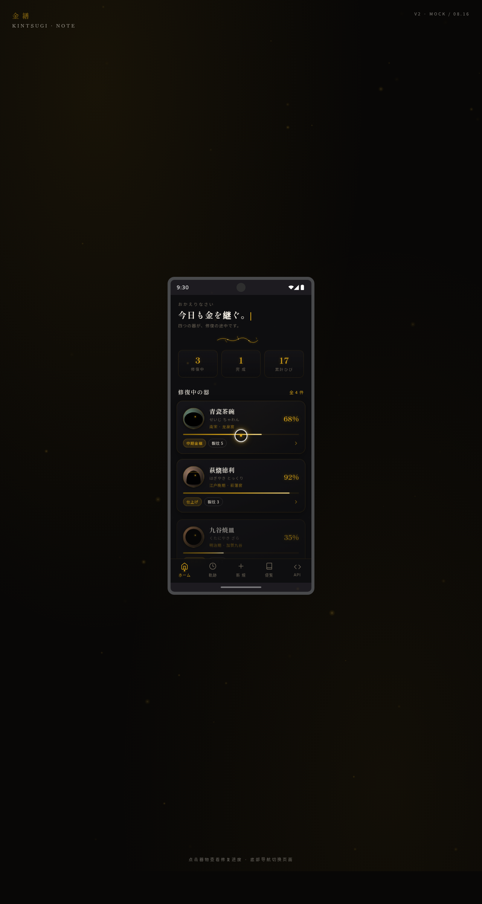

# Kintsugi 金缮笔记 — 器物修复日记 App

> 2026-08-16 · 手机应用 UI

## 简介

以日本金缮（金継ぎ）修复哲学为灵感的器物修复日记 App。为每件破碎器物建立修复档案，记录裂纹、金缮描金进度、修复日志与情感手记。在统一手机外壳内切换 6 个页面：首页器物卡片流、器物详情（裂纹金线进度可视化）、新建档案四步流程、修复时间轴、设计规范页、接口文档页。漆黑 + 金缮金 + 胡粉白配色，日式器物修复的沉静仪式感。

## 截图

## 文件说明

| 文件 | 说明 |
|------|------|
| `index.html` | 入口（加载 React + Babel） |
| `app/app.jsx` | App 主框架与页面路由 |
| `app/components.jsx` | 共享组件库 |
| `app/data.jsx` | 模拟数据 |
| `app/effects.jsx` | 动效逻辑（光标、粒子、金线生长等） |
| `app/pages/*.jsx` | 各页面（home / detail / new / timeline / design-spec / api-docs） |
| `frames/android-frame.jsx` | 手机外壳框架 |

## 动效亮点

- 自定义光标：白环 + 金点 + 双层发光 + 弹簧跟随 + 悬停放大 + 点击涟漪
- 金粉粒子背景（60 粒子 + 鼠标反平方斥力 + 闪烁漂移）
- 签名动效：金缮描金沿 SVG 路径生长（stroke-dashoffset）
- 器物详情裂纹金线按进度数依次生长
- 卡片 3D 倾斜（RAF 弹簧缓动，纯 DOM 操作）+ 金粉光泽扫过
- 数字计数 + 打字机标题 + 进度环描边 + 列表滚动渐入 stagger
- 节点脉冲发光 + 照片占位浮动 3D 摆动 + 页面切换转场

## 健壮性

visibilitychange 自动暂停 RAF、reduced-motion 降级、定时器统一管理、mousemove 直接操作 DOM 不触发 React 重渲染。

## 在线预览

妙搭应用链接：https://dcniaqwtmoca.feishu.cn/page/YYodmsrH1dy0F3a8qKjcQ8KPnFI

## 技术栈

React 18 + Babel Standalone，多 jsx 模块，纯前端无后端。
