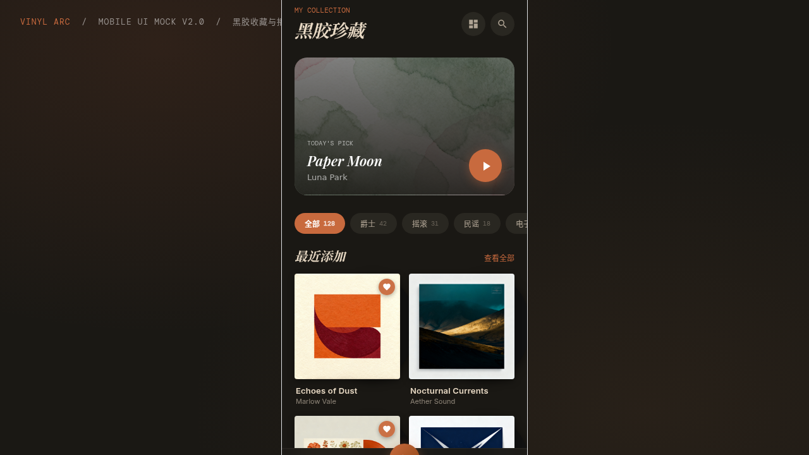

# Vinyl Arc — 黑胶唱片收藏 App

> 2026-08-16 · 手机应用 UI

## 简介

一场复古暖调的黑胶收藏与播放体验。整套配色为暖棕陶土 + 深棕底 + 奶白文字，无任何蓝紫渐变。8 屏完整 App，含设计规范与接口文档内嵌页面，所有签名动效基于物理逻辑实现（黑胶旋转、唱针摆动、3D 倾斜）。

## 截图

## 文件说明

| 文件 | 说明 |
|------|------|
| `index.html` | 入口 HTML（需妙搭运行时渲染） |
| `app.jsx` | 应用根组件与页面路由 |
| `pages.jsx` | 8 个页面实现 |
| `components.jsx` | 通用组件（黑胶、播放器、曲目列表等） |
| `ios-frame.jsx` | iPhone 手机外壳与设备框架 |
| `tweaks-panel.jsx` | 底部调试面板 |
| `data.jsx` | 模拟唱片数据 |
| `package.json` | 依赖声明 |
| `设计规范.md` | 设计规范文档（色彩 / 组件 / 动效 / 页面结构） |

## 页面结构（8 屏）

1. 首页·收藏
2. 发现页
3. 唱片详情（大封面视差头图 + 按 Side 分组曲目）
4. 全尺寸播放器
5. 动态时间线
6. 个人中心
7. 设计规范
8. 接口文档（8 个 REST 端点）

## 签名动效

- 全尺寸播放器：黑胶持续旋转 + 唱针平滑摆动入场
- 唱片卡片：3D 倾斜跟随鼠标，hover 时黑胶从封套露出
- 唱针式自定义光标：内环精准点 + 外环缓动跟随，初始显示在屏幕中央
- 列表交错入场、Mini Player 悬停弹出、进度条实时推进

## 在线预览

妙搭应用链接：https://dcniaqwtmoca.feishu.cn/page/REGgm64uddn2VWaNXFmcqYMon6d

## 技术栈

React (JSX) · 纯前端 · localStorage 持久化

形态：原生 App
