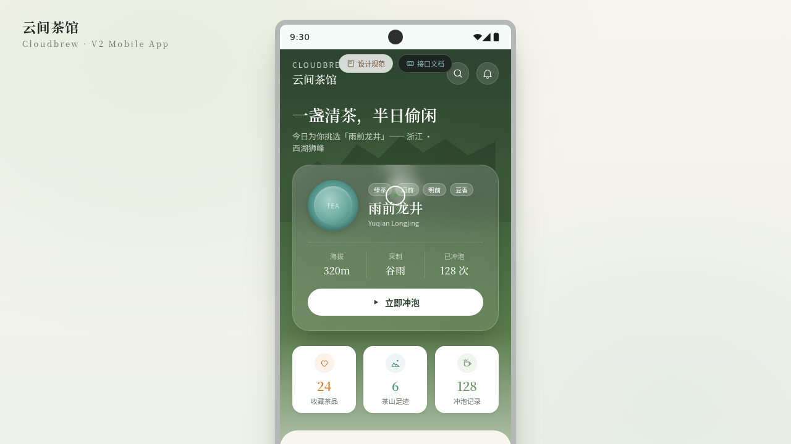

# 云间茶馆 Cloudbrew

- 日期：2026-08-16
- 方向：手机应用 UI（V2）
- 主题：高山云雾采茶 / 茶室预约 / 茶品收藏 App

## 简介
统一手机外壳内 8 页可切换的完整 App：今日茶席、茶山探索、茶品市集、冲泡计时器、我的茶仓、茶品详情、设计规范、接口文档。每页独立布局语言，雾绿+栗棕+米白+釉青+焙火橙配色。

## 截图

## 动效亮点
- 签名动效 1：首页茶杯蒸腾茶烟（RAF 粒子系统 + 正弦漂移）
- 签名动效 2：冲泡计时器水波涟漪
- 3D 卡片倾斜、打字机、数字计数、光泽扫过、脉冲环、spring-pop 入场、弹性 FAB、毛玻璃、叶片漂浮
- 自定义光标三态 + 涟漪
- 12+ 组件级特效

## 布局丰富度
8 页中 ≥5 种非重复布局：Hero 视差、对角分割、瀑布流+底部抽屉、圆环进度沉浸、环形进度网格、画廊渐变表头、深色代码文档。

## 文件说明
| 文件 | 说明 |
|------|------|
| index.html | 完整可运行源码（含内联 CSS/JSX，自包含） |
| components/ | inline 前的源码留存（android-frame.jsx / tweaks-panel.jsx） |
| 设计规范.md | 色彩/字体/页面/组件/动效 |
| preview.png | App 截图 |

## 妙搭在线预览
https://dcniaqwtmoca.feishu.cn/page/Qx1emL7hwdQULja3JCvcwcyRn3e

## 技术栈
HTML + 内联 CSS + React (Babel standalone 内联 JSX)。
