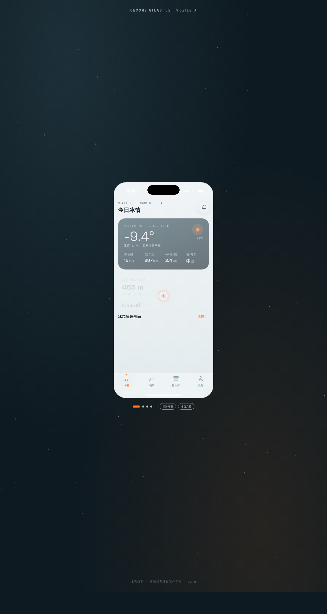

# 冰芯档案 Icecore Atlas · 极地科考 App

> Arc 每日设计 Mock · 2026-08-16 · V2 手机应用 UI

## 基本信息

- **日期**：2026-08-16
- **版本**：V2
- **方向**：手机应用 UI（统一手机外壳内多页面切换）
- **主题**：冰芯档案 Icecore Atlas —— 极地冰芯科考队员的移动工作 App
- **配色**：冰白 `#F0F4F6`（底）+ 钢青灰 `#33505C` + 信号橙 `#FF7A1A` + 深墨 `#16232B`，极地科考仪器质感，无蓝紫渐变

## 设计说明

以科考队员日常作业为线索组织 6 个页面：今日冰情（气象 / 冰层概览）、钻探记录（冰芯钻取进度与层理剖面）、样本库（冰芯样本编目检索）、我的（队员 / 设备），外加设计规范页与接口文档页。底部导航 + 外部快捷切换圆点均可点击。Tweaks 面板可切换「降低动效」「密度」等参数。

## 交互说明

- 底部导航栏与外部圆点切换 6 个页面，所有按钮 / 卡片 / Tab / Chip 均可交互
- 钻探记录页冰芯层理扫描线 + 橙色扫描光带
- 样本库可检索筛选
- 自定义光标：白色粗环 + 信号橙内点 + 多层发光，悬停放大变色，点击涟漪

## 动效原理（12+ 组件级特效）

冰芯层理扫描线 / 冰层气泡浮力上浮（buoyancy + drag 终端速度模型）/ 钻取进度阻尼推进（spring-damper 二阶系统）/ 雪花粒子飘落（重力 + 风力 + 终端速度）/ 3D 卡片倾斜 / 滚动渐入（IntersectionObserver）/ 悬停辉光 / 打字机光标 / 数字计数（easeOutCubic）/ 鼠标视差 / 光泽扫过 / 头像脉冲环 / 频谱柱动画。RAF 随 `visibilitychange` 暂停，切换页面自动清理，高频鼠标事件直接操作 DOM transform，`prefers-reduced-motion` 降级。

## 截图



## 在线预览

https://dcniaqwtmoca.feishu.cn/page/NXaGmVAqQdnAlYaj7ZrcnmAPn9e

## 文件结构

```
2026-08-16_冰芯档案_icecore-atlas/
├── index.html        # 入口
├── components/       # 页面与组件
├── preview.png       # 截图
└── README.md
```

## 本地运行

```bash
cd 2026-08-16_冰芯档案_icecore-atlas
python3 -m http.server 8090
# 浏览器打开 http://127.0.0.1:8090
```
