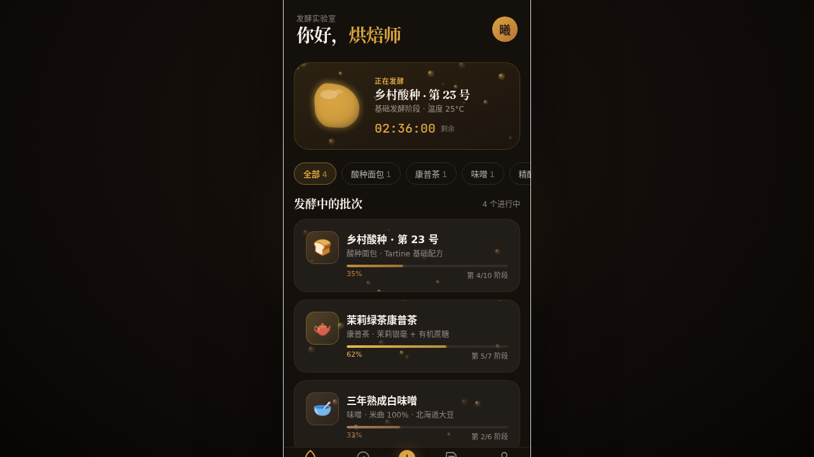

# 发酵实验室 · Fermentary

> 2026-08-16 · 手机应用 UI（V2） · 统一手机外壳内 8 页 App

面包与发酵爱好者的时间管理 App：发酵批次列表与详情、发酵时间线倒计时、新建批次流程、风味笔记、探索、我的，另含设计规范页、接口文档页与 Tweaks 调参面板。

## 设计说明

- **配色**：奶白 `#F7F2E9` + 深可可黑 `#2B1D16` + 黄油暖黄 `#D9A441`，辅以焦糖棕 `#B87333`，深浅模式可切换
- **字体**：Fraunces（衬线展示）/ Inter（正文）/ JetBrains Mono（计时数据）
- **动效亮点**：CO₂ 气泡上升（Canvas，速度随发酵活跃度变化）、面团呼吸膨胀（SVG 贝塞尔变形）、环形倒计时、页面转场（模糊 + 弹簧）、自定义光标（白环 + 黄油内点 + 涟漪）
- 详见 [设计规范.md](./设计规范.md)

## 在线预览

飞书妙搭应用：https://dcniaqwtmoca.feishu.cn/page/O07GmzmPrdXeAiaaa9UcV0HknEg

## 文件说明

| 文件 | 说明 |
|------|------|
| `index.html` | 入口（全局样式 + 光标逻辑 + Tweaks 默认值） |
| `components/ios-frame.jsx` | 手机外壳 |
| `components/tweaks-panel.jsx` | 调参面板 |
| `app/*.jsx` | data / utils / effects / components / pages / app |
| `设计规范.md` | 色彩 / 字体 / 页面 / 动效规范 |
| `thumbnail.png` | App 截图 |

## 技术栈

React 18 + Babel Standalone + 纯 CSS，无构建步骤。
