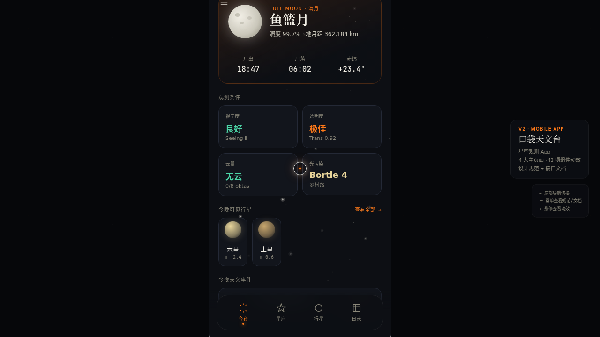

# 口袋天文台 Pocket Observatory · 星空观测 App

> 每日设计 Mock · 2026-08-16 · Batch 6 · V2 手机应用 UI

## 主题

「口袋天文台 Pocket Observatory」——一款星空观测手机 App。围绕今夜天象、星座辨认、行星追踪、观测日志组织内容，以 SVG 星轨描边动画为签名动效。在统一手机外壳内可切换多个页面。

## 配色

午夜黑 `#0D0F14` · 月白 `#F2EFE6` · 彗星橙 `#FF7A1A`，辅以极光绿与黄道金
（严格禁蓝紫渐变）

## 字体

Cormorant Garamond 展示字 · Inter 正文 · JetBrains Mono 数据字体

## 页面结构

**4 大主页面**
- 今夜天象：月相 / 观测条件 / 事件时间线
- 星座辨认：88 星座图鉴 + SVG 连线动画
- 行星追踪：轨道运行 + 光谱分析
- 观测日志：统计 + 记录列表

**2 个次级页**
- 设计规范页：色彩 / 字体 / 组件 / 动效规范
- 接口文档页：REST API + 响应示例

**侧滑菜单**：统一入口跳转规范 / 文档页

## 交互说明

- 底部导航切换 4 大主页
- 星座图鉴 SVG 连线描边渐现
- 行星轨道运行可交互
- Tweaks 面板：强调色切换、动效开关、粒子密度等可调项

## 动效原理说明（13 项组件级特效）

1. 自定义光标：弹簧阻尼跟随 + 悬停态 + 涟漪
2. 三层视差星野粒子
3. 数字计数
4. 打字机
5. 3D 磁性倾斜卡
6. 悬停发光
7. **星轨签名**：SVG 描边动画 + 星点节点渐现
8. 脉冲头像
9. 天体频谱条
10. 光泽扫过
11. 潮汐波形
12. 磁吸按钮
13. 滚动渐入

物理模型：弹簧 Hooke 定律、惯性动量、磁性反平方引力、阻尼摩擦、RAF 积分器。支持 `prefers-reduced-motion` 降级。

## 截图



## 在线预览

https://dcniaqwtmoca.feishu.cn/page/O8XHmAhwOdCzyBad8hgcpCBTnNh

## 文件结构

```
2026-08-16_口袋天文台_pocket-observatory/
├── index.html              # 入口（手机外壳 + React 挂载）
├── styles.css              # 样式
├── jsx/
│   ├── app.jsx             # 应用主体
│   ├── screens.jsx         # 各页面
│   └── effects.jsx         # 动效逻辑
└── components/
    ├── ios-frame.jsx       # 手机外壳
    └── tweaks-panel.jsx
```

## 本地运行

直接用浏览器打开 `index.html`，或：

```bash
python3 -m http.server 8080
# 访问 http://localhost:8080/index.html
```
