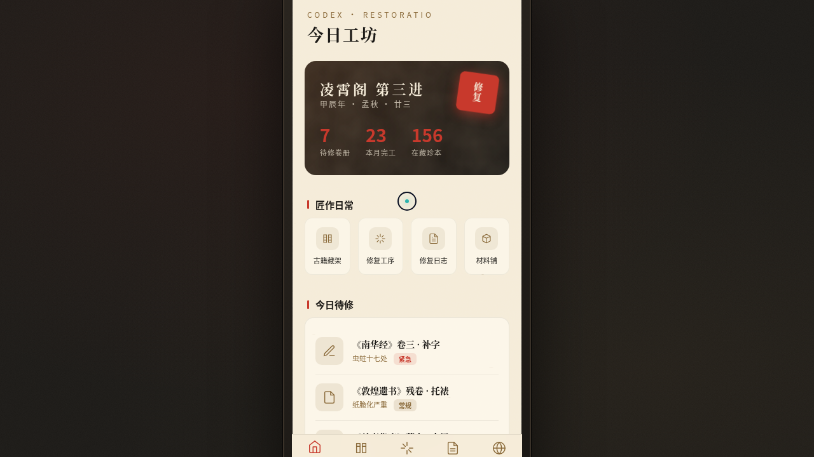

# 古籍修复工坊 Codex Restoratio

> Arc 每日设计 Mock · 2026-08-16 batch5 · V2 手机应用 UI



## 在线预览

https://dcniaqwtmoca.feishu.cn/page/SEmOmTUQRdnhl7arkHQcNH9cnHe

## 概述

一个完整多页面的古籍修复记录 App，在统一手机外壳内可切换 8 个页面：今日工坊、古籍藏架、修复工序、修复日志、材料铺、古籍详情、设计规范、接口文档。围绕「修复一页古籍」的匠作日常组织内容与动效。

- **方向**：手机应用 UI
- **主题**：古籍修复工坊
- **配色**：宣纸米 #f5ecd9 + 墨黑 #1c1a17 + 朱砂红 #c8392c + 古铜 #8a6a3a（无蓝紫渐变）
- **实现**：纯 vanilla 单文件 HTML+CSS+JS，8 页面 + 设计规范 + 接口文档

## 交互说明

- 底部导航切换 8 页面，卡片重排错峰淡入。
- 今日工坊：数字计数动画 + 朱砂印章呼吸脉冲。
- 古籍藏架：卡片 3D 倾斜 + 光泽扫过。
- 修复工序：毛刷刷过进度条，点击「开始修复」触发墨迹晕染。
- 修复日志：条目悬停位移 + 阴影。
- 自定义光标开页居中显示，悬停可交互元素放大，点击涟漪。

## 动效原理

详见 [设计规范.md](./设计规范.md)。13 个组件级特效，基于物理模型（弹簧 Hooke、摩擦阻尼、easeOutCubic）与古籍修复主题语义（毛笔晕染、朱砂印章落下、毛刷扫过、纸张纤维飘动）。

## 健壮性

- visibilitychange 暂停 RAF/定时器；所有定时器统一管理，卸载清理。
- 高频事件直接 DOM transform。
- 支持 prefers-reduced-motion。
- 纯 vanilla 单文件，无 React/Babel/CDN 依赖。

## 文件结构

```
2026-08-16_古籍修复工坊_codex-restoratio/
├── index.html       # 单文件源码（8 页面）
├── preview.png
├── 设计规范.md
└── README.md
```

## 本地运行

直接用浏览器打开 `index.html`；或 `python3 -m http.server` 后访问。

形态：原生 App
