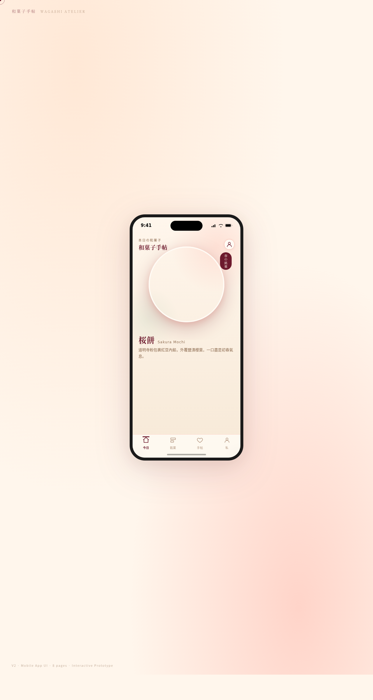

# 和菓子手帖 Wagashi Atelier · 手机应用 UI Mock

- 日期：2026-08-16
- 方向：V2 手机应用 UI
- 主题：日式和菓子（传统点心）品牌手机 App —— 季节限定点心浏览、在线预订、收藏手帖、会员茶席

## 简介

在统一手机外壳内可切换 8 个页面，每页布局语言互不重复：今日（Hero 大图 + 滚动视差）、銘菓（瀑布流）、点心详情（底部弹出抽屉 + 视差）、ご予約（步骤条 + 日历）、收藏手帖（Bento 拼贴 + FAB）、私（环形进度 + 会员卡）、デザイン規範（设计规范页）、API ドキュメント（接口文档页）。蜜桃粉 + 酒红 + 豆绿 + 奶油的温润日系甜点气质。

## 截图

## 动效亮点

- 首页入场序列：标题 / 价格 / 标签 / 卡片错峰弹性入场（cubic-bezier 弹簧曲线）
- 详情页抽屉弹簧上滑：Hooke 弹簧曲线展开 + 图片视差滚动
- 我的页环形进度：stroke-dashoffset 描边动画
- 自定义光标、按钮涟漪、分类重排、日期弹跳、FAB 阴影等 12+ 项组件级特效
- `prefers-reduced-motion` 降级，RAF 随可见性暂停

## 妙搭在线预览

https://dcniaqwtmoca.feishu.cn/page/G3rgmK6QhdDK1zahGW1clUg5n9b

## 文件说明

| 文件 | 说明 |
|---|---|
| index.html | 完整可运行源码（HTML + 内联 CSS + 内联 JSX） |
| components/ | 组件源码目录 |
| 设计规范.md | 色彩 / 字体 / 组件 / 动效 / 页面结构规范 |
| preview.png | 页面截图 |

## 技术栈

纯前端单文件：HTML + 内联 CSS + 内联 Babel JSX，无外部 JSX 引用。
