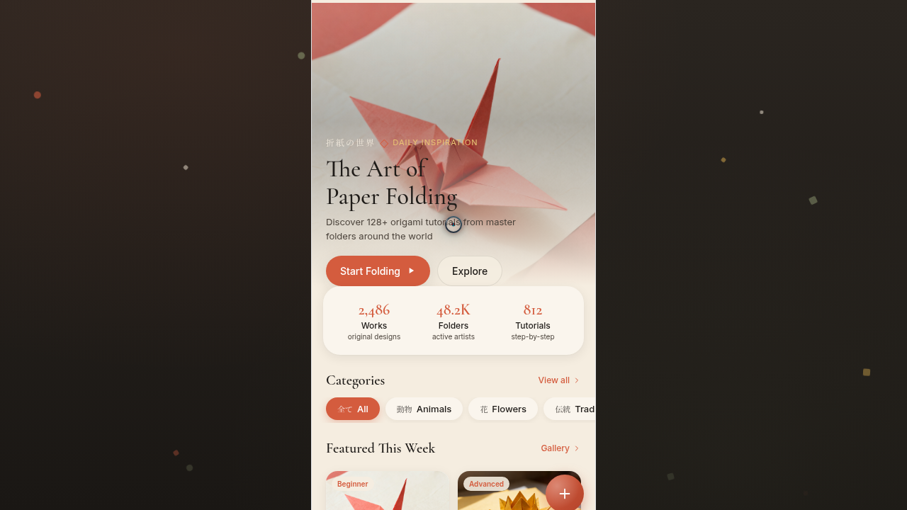

# 折纸工坊 Origami Atelier

- **日期**：2026-08-16
- **方向**：V2 手机应用 UI
- **形态**：原生 App
- **主题**：折纸工坊——折纸爱好者的作品集与教程 App
- **配色**：和纸米白 `#F5EDE0` + 珊瑚朱红 `#D45C3E` + 芥末黄 `#D4A74A` + 灰绿 `#8B956D` + 炭黑 `#1E1B18`（纸感暖色系，无蓝紫渐变）

## 简介

统一手机外壳内可切换 8 个页面的折纸 App：首页作品流、作品库瀑布流、折叠教程步骤、纸张材质库、个人主页、收藏堆叠卡、设计规范页、接口文档页。每页拥有独立布局语言与色彩主角，签名动效为开场折纸鹤折叠入场与教程页折纸示意图随步骤旋转展开。

## 截图

## 动效亮点

- 签名：开场折纸鹤折叠入场（SVG 缩放旋转 + 米白遮罩淡入）
- 签名：教程页折纸示意图随步骤旋转展开
- 自定义光标（lerp 平滑 + 悬停放大 + 涟漪）
- 飘落纸片粒子 / 数字计数 / 卡片入场 stagger
- 3D 卡片倾斜 / 头像脉冲环 / 环形进度描线
- 收藏堆叠卡 spring 缓动 / FAB 发光脉冲
- 共 12+ 项组件级特效

## 妙搭在线预览

https://dcniaqwtmoca.feishu.cn/page/WD9FmnF2KdR67Ba1kT1cp5aZnFg

## 文件说明

| 文件 | 说明 |
|---|---|
| `index.html` | 完整可运行源码（JSX 内联，入口） |
| `ios-frame.jsx` | 手机外壳组件源码 |
| `thumbnail.png` | 页面预览截图 |
| `设计规范.md` | 色彩系统、字体、组件、页面结构、动效规范 |

## 技术栈

React（JSX 内联于 `<script type="text/babel">`）+ Babel standalone + 内联 CSS
