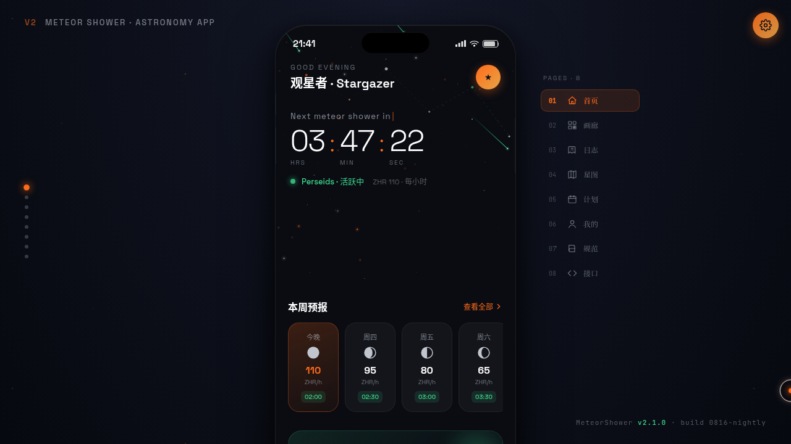

# 流星雨 Meteor Shower — 天文观测 App

> **日期**: 2026-08-16  
> **方向**: V2 手机应用 UI  
> **主题**: 天文观测与流星记录 App

## 简介

一个完整的天文观测 App，用户可追踪流星雨预报、记录观测数据、浏览天文图库、管理观测计划。8 个页面布局各异，在统一手机外壳内切换。

## 动效亮点

- 三态自定义光标（默认/悬停/点击 + 涟漪，流星橙色）
- Canvas 流星粒子场（物理轨迹：初速度+重力+衰减）
- 恒星闪烁（独立频率与相位）
- 3D 轮播画廊 Hero
- 堆叠卡片 3D 倾斜（mousemove 驱动）
- 三环径向进度（个人中心）
- 辐射点环形脉冲
- FAB 脉冲呼吸
- 头像光环旋转（conic-gradient）
- 页面切换模糊入场
- 流星拖尾辉光
- shimmer 光泽扫过

## 页面清单

1. 首页 — Hero 倒计时 + 视差星座线 + 横滑预报条
2. 流星画廊 — 3D 轮播 + 瀑布流马赛克
3. 观测日志 — 堆叠卡片 + 数据统计 + FAB
4. 实时星图 — 对角分割 + 辐射点脉冲 + 抽屉
5. 个人中心 — 三环进度 + 成就徽章 + 头像脉冲
6. 设计规范 — Tab 切换 + 色阶条 + 字号阶梯
7. 接口文档 — 左右分栏方法列表 + 详情
8. 观测计划 — 日历网格 + 时间轴 + 装备清单

## 文件说明

| 文件 | 说明 |
|------|------|
| `index.html` | 主入口（内联 JSX + Babel） |
| `ios-frame.jsx` | 手机外壳组件 |
| `tweaks-panel.jsx` | 微调面板组件 |
| `设计规范.md` | 色彩系统、字体、组件、动效规范 |
| `preview.png` | 页面截图 |
| `thumbnail.png` | 缩略图 |

## 在线预览

[流星雨 Meteor Shower 妙搭应用](https://dcniaqwtmoca.feishu.cn/page/WZAtmmup3d6yoIa010rc1J3KnVd)

## 技术栈

React（内联 JSX + Babel standalone）、Canvas 2D 粒子系统、CSS 变量主题、手机外壳框架、prefers-reduced-motion 降级
