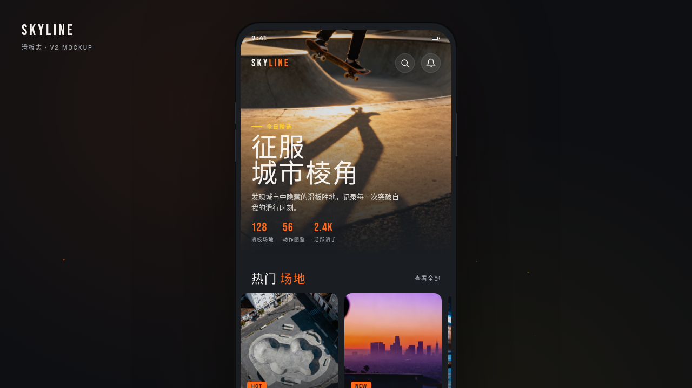

# SKYLINE 滑板志 · 街头滑板文化 App

- 日期：2026-08-16
- 方向：V2 手机应用 UI
- 主题：面向滑板爱好者的城市滑板文化应用
- 配色：石墨灰 #23262B + 荧光橙 #FF6B1A + 雾白 #F5F3EF + 电光黄 #FFD21F

## 简介

「SKYLINE 滑板志」是街头滑板文化 App，在统一手机外壳内切换 8 个页面：发现（场地/动作推荐）、场地探索（地图 + 底部抽屉）、动作图鉴（环形进度 + 弹簧勾选）、装备商店（白底瀑布网格）、社区动态（故事环 + 图片 feed）、个人中心（封面 + 成就徽章）、设计规范、接口文档。每页布局语言各不相同，避免"标题栏+列表"模板套壳。

## 截图

## 动效亮点

自定义光标（弹簧 + 混色 + 涟漪）、环境粒子、Hero 视差、地图地钉弹簧弹跳、底部抽屉惯性滑入、动作勾选圆环、故事环 conic 旋转、光泽扫过、头像脉冲、FAB 悬停旋转、徽章弹起、点赞心形发光、页面切换惯性过渡。签名动效：首页入场序列、场地视差滚动、动作圆环进度、个人页环形进度。

## 妙搭在线预览

https://dcniaqwtmoca.feishu.cn/page/ORwFmbqMYdBlimaAVw2ciCZrn0c

## 文件说明

| 文件 | 说明 |
|---|---|
| index.html | 完整可运行源码（JSX/CSS 全内联） |
| components/ | 拆分组件源码（android-frame.jsx 等，已内联进 index.html） |
| 设计规范.md | 色彩系统、字体、页面布局、组件、动效 |
| preview.png | 应用截图 |

## 技术栈

React 18 + Babel standalone（JSX 全内联）+ 原生 RAF 动效。运行于妙搭 html 应用。

形态：原生 App
