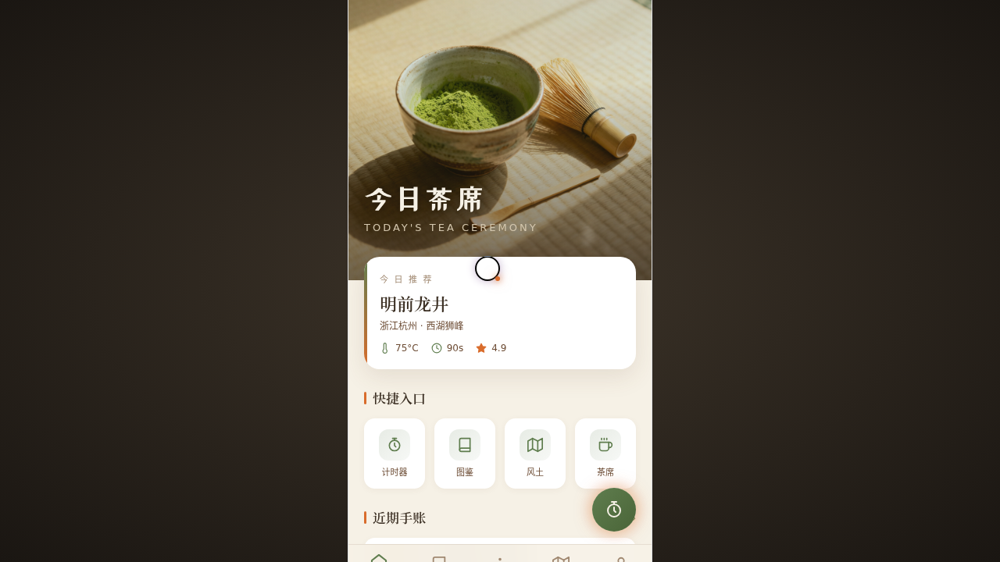

# 煎茶物语 Sencha Journal

> 2026-08-16 · V2 手机应用 UI · 手机 mock

## 主题

「煎茶物语 Sencha Journal」——一款茶道手账手机 App。围绕今日茶席、冲泡计时、茶器图鉴、茶园风土、个人成就展开，另含设计规范页与接口文档页，共 8 页。抹茶绿 + 米白 + 栗棕 + 柿橙点缀的东方茶事配色。

## 简介

统一手机外壳内可切换 8 页，每页布局语言各异：首页 Hero 视差 + 卡片堆叠、计时器环形进度 + 步骤流、茶器图鉴瀑布流、茶园风土网格拼贴、个人页渐变头图 + 徽章网格、设计规范色卡网格、接口文档深色代码风、更多菜单底部抽屉。含启动 splash 与签名动效。

## 截图

## 动效亮点

- 首页入场序列动画 + 5 柱不同周期蒸汽（主题语义）
- 冲泡计时器环形进度（conic-gradient + RAF 积分，毫秒精度）+ 主按钮柿橙脉冲
- 个人页头像双层脉冲环 + 成就进度条 ease 填充
- 自定义光标、环境粒子、Tab 弹出、底部抽屉 spring 弹出
- 共 13 项组件级特效

## 妙搭在线预览

https://dcniaqwtmoca.feishu.cn/page/WrhUmqKbRdmxRsa3HhQc6jvVn2f

## 文件说明

| 文件 | 说明 |
|---|---|
| index.html | 完整可运行源码（React + Babel 内联，ios-frame.jsx 已内联） |
| components/ios-frame.jsx | 手机外壳组件源码（已内联进 index.html，保留作参考） |
| 设计规范.md | 色彩系统、字体、页面布局差异化、动效系统 |
| thumbnail.png | 页面截图 |

## 技术栈

React 18 + Babel Standalone（CDN），统一手机外壳 + 多页切换，单 HTML 文件。
