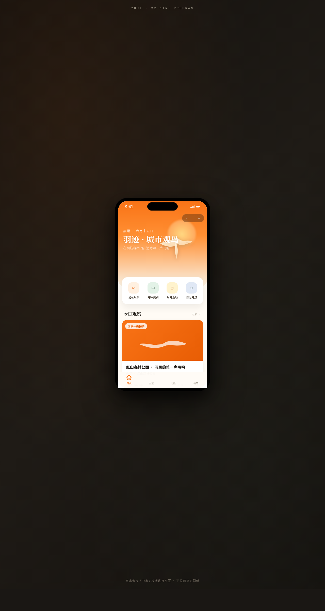

# 羽迹 · 城市观鸟 Yuji Birdwatch

形态：微信小程序

- 日期：2026-08-16
- 方向：手机 UI（V2）
- 主题：城市观鸟爱好者的观察记录与鸟种图鉴微信小程序

## 简介

套在统一手机外壳内的微信小程序形态多页 App：胶囊按钮自定义导航栏 + 底部 TabBar（4 项 + 选中弹跳）+ 页面栈 push/pop。8 个页面布局各异——首页晨曦橙 Hero 配羽毛飘落入场与下拉弹性刷新、图鉴页苔绿头部吸顶 Tab + 瀑布流 + 骨架屏、观察详情视差 Hero + 音频波形 + 吸底操作栏、记录地图浮动面板 + Pin 脉冲、活动卡片堆叠 + 时间轴、个人中心暗色头部 + 环形进度 + 宫格、设计规范页、接口文档左右分栏。内容围绕真实鸟种 / 观察笔记 / 观鸟活动组织，无 lorem ipsum。

## 截图

## 动效亮点

- 羽毛飘落入场序列（首页签名动效）
- 环形进度描边（个人中心签名动效）
- 下拉弹簧弹性回弹刷新
- 音频波形脉冲 + 点赞心形粒子爆裂
- 地图 Pin 脉冲 Ping
- Tab 选中弹跳 / ActionSheet 滑入 / 骨架屏 shimmer

## 妙搭在线预览

https://dcniaqwtmoca.feishu.cn/page/HGqhmM1jvd6j3qat6f2ctx41nif

## 文件说明

| 文件 | 说明 |
|------|------|
| index.html | 完整可运行源码（React + Babel 内联，单文件） |
| 设计规范.md | 色彩 / 字体 / 组件 / 动效 / 页面结构（含形态标记） |
| preview.png | 页面截图 |
| thumbnail.png | 平台生成缩略图 |

## 技术栈

React 18 + Babel standalone（全部内联在 `<script type="text/babel">`），无外部 JSX 文件。
