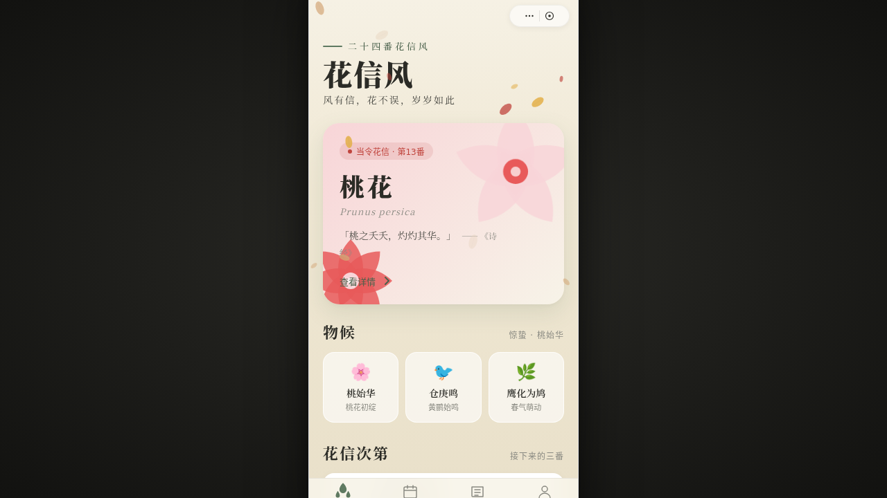

# 花信风 · 二十四番花信风小程序 · V2 手机 UI

形态：微信小程序

- 日期：2026-08-16
- 方向：V2 手机 UI
- 形态：微信小程序
- 主题：古人以二十四番花信风应花期，从小寒到谷雨每候一花——国风笺谱质感的小程序
- 配色：艾绿 #5F7A61 + 宣纸白 #F7F3E8 + 胭脂红 #C0453E + 藤黄 #E3B04B + 墨色 #2B2B26

## 简介

「花信风」是微信小程序形态的多页面手机端 mock，套在统一 iOS 外壳内，带胶囊按钮自定义导航栏。8 个页面：首页（当期花信 Hero + 物候）、花历（吸顶月份 Tab + 错落网格）、花鉴详情（滚动视差 + 吸底操作栏）、花讯（文章流 + 左滑收藏）、文章详情、我的（环形进度 + 宫格）、设计规范、接口文档。内容真实可信（二十四番花信、物候、诗词）。

## 小程序端侧交互

胶囊按钮导航栏 / 页面栈 push/pop / 底部 TabBar 弹性 / 半屏 ActionSheet / 下拉刷新弹性 / 左滑收藏 / 吸顶 Tab / 骨架屏加载 / 吸底操作栏。

## 签名动效

- 花瓣飘落粒子（RAF 积分器 + 重力 + 风阻）
- 首页花朵绽放入场序列
- 详情页滚动视差
- 个人页环形进度

## 妙搭在线预览

https://dcniaqwtmoca.feishu.cn/page/ONJjmMltudowluarmbRc4sHfnHf

## 截图

## 文件说明

| 文件 | 说明 |
|---|---|
| index.html | 完整源码（JSX/CSS 全内联） |
| components/ios-frame.jsx | iOS 设备外壳组件源码 |
| thumbnail.png | 页面截图 |
| 设计规范.md | 色彩/字体/组件/动效/页面规范 |

## 技术栈

React 18 + Babel standalone（JSX 全内联）+ 原生 RAF 动效，运行于妙搭 html 应用。
