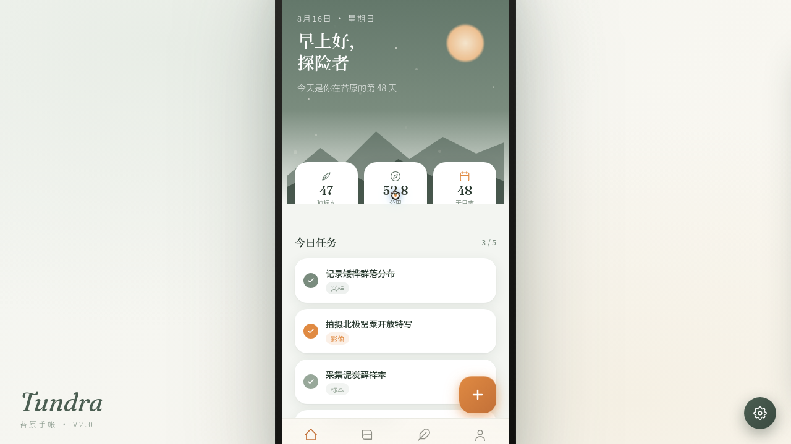

# Tundra 苔原手帐

- **日期**：2026-08-16
- **方向**：V2 手机应用 UI（phone_mock）
- **主题**：极地植物标本收集手记 App——探险者记录苔原植物、观察日记与图鉴收藏

## 简介

雾灰绿 + 燕麦奶白 + 焦糖 + 炭黑四族色阶。8 个页面在统一手机外壳内切换，每页布局语言各异：Hero 视差首页、瀑布流图鉴、对角分割标本详情、底部抽屉日记、环形进度个人页、暗色代码风接口文档、3 步引导新建记录，另含设计规范页。每页 3–5 个色调层次，各有色彩主角。

## 动效亮点

首页入场交错序列 + 呼吸太阳（签名动效 1）、标本详情对角分割视差滚动（签名动效 2）、个人页 Canvas 环形进度、头像脉冲光环、弹簧 3D 倾斜卡片、打字机、数字计数、FAB 悬停旋转等 12+ 组件级特效。

## 文件说明

| 文件 | 说明 |
|---|---|
| `index.html` | 应用入口（JSX 内联；实际预览走妙搭链接） |
| `设计规范.md` | 四族色阶 / 字体 / 8 页布局 / 动效 / Tweaks 规范 |
| `preview.png` / `thumbnail.png` | 页面截图 |
| `README.md` | 本文件 |

## 在线预览

妙搭链接：https://dcniaqwtmoca.feishu.cn/page/WHzymGDKOd2rWlab9I3c5bhknre

## 技术栈

HTML + React 18（CDN）+ Babel standalone 内联 JSX + Canvas 环形进度；Tweaks 面板 7 项实时调节（主色/动效强度/粒子密度/光标/深色/字体密度/音效）；支持 prefers-reduced-motion。

形态：原生 App
