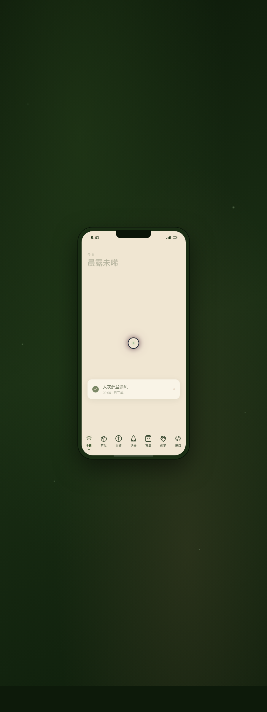

# 苔藓盆景志 Mossbox · 苔藓微景观养护 App

> Arc 每日设计 Mock · 2026-08-16 · batch 4 · V2 手机应用 UI

## 基本信息

- **日期**：2026-08-16
- **版本**：V2（batch 4）
- **方向**：手机应用 UI（完整多页面手机 App，统一手机外壳内切换）
- **主题**：苔藓盆景志 Mossbox —— 苔藓微景观（苔盆 / 微缩生态缸）养护与鉴赏 App
- **配色**：苔藓深绿 `#2D4A1F`（主）+ 墨绿 `#1A2E14`（深底）+ 陶土棕 `#A67B5B`（次强调）+ 羊皮米 `#F0E6D2`（米白底）+ 雾绿 `#7A9B6E`，湿润幽静的东方盆景美学，无蓝紫渐变
- **实现**：纯 vanilla 单文件 HTML，无 React/Babel/CDN 依赖

## 设计说明

在统一手机外壳内通过底部 Tab 切换 8 个页面：① 今日（养护任务 + 天气湿度联动 + 苔语）② 我的苔盆（网格陈列 + 养护统计 + 环境概览）③ 苔盆详情（露珠物理系统 + 七日湿度曲线描边 + 养护指标 + 喷雾提醒）④ 图鉴（6 种苔藓物种卡，悬停 3D 倾斜）⑤ 喷雾记录（时间线 + 统计数字计数）⑥ 市集（分类筛选 + 商品列表）⑦ 设计规范（5 色板 + 4 级字体 + 组件样例）⑧ 接口文档（6 个 REST API，可展开请求/响应示例）。

## 交互说明

- 自定义「露珠」光标：开页即居中显示，悬停三态切换，点击涟漪
- 底部 Tab 切换页面，惯性弹性滑动（动量 + 摩擦衰减）
- 苔盆详情页露珠凝结滚落（物理：重力 + 表面张力近似 + 摩擦反弹）
- 湿度曲线手绘描边动画
- 图鉴卡 3D 倾斜（mousemove 直接操作 DOM transform）
- 接口文档条目可展开/收起

## 动效原理（12+ 个组件级特效）

露珠光标（开页居中 + 悬停三态 + 点击涟漪）/ 露珠凝结滚落（RAF 积分器 + 重力 + 表面张力 + 摩擦反弹）/ 湿度曲线描边（dashoffset 动画）/ Tab 惯性弹性切换 / 卡片滚动渐入 / 卡片悬停发光 / 数字计数（湿度% / 养护天数，缓动）/ 涟漪 / 图鉴卡 3D 倾斜 / 光泽扫过 / 雾绿呼吸脉冲 / 页面转场。各动效周期不同。RAF/定时器统一管理，切换页面重建前先清理旧的；`visibilitychange` 自动暂停/恢复；`prefers-reduced-motion` 全量降级；高频 mousemove 直接操作 DOM transform 不触发重渲染。

## 截图



## 在线预览

https://dcniaqwtmoca.feishu.cn/page/M1kgmKDVxdonEIaZgkkcbMScnAc

## 文件结构

```
2026-08-16_苔藓盆景志_mossbox/
├── index.html      # 单文件入口（含全部样式与脚本）
├── preview.png     # 长截图
└── README.md
```

## 本地运行

```bash
cd 2026-08-16_苔藓盆景志_mossbox
python3 -m http.server 8090
# 浏览器打开 http://127.0.0.1:8090
```
