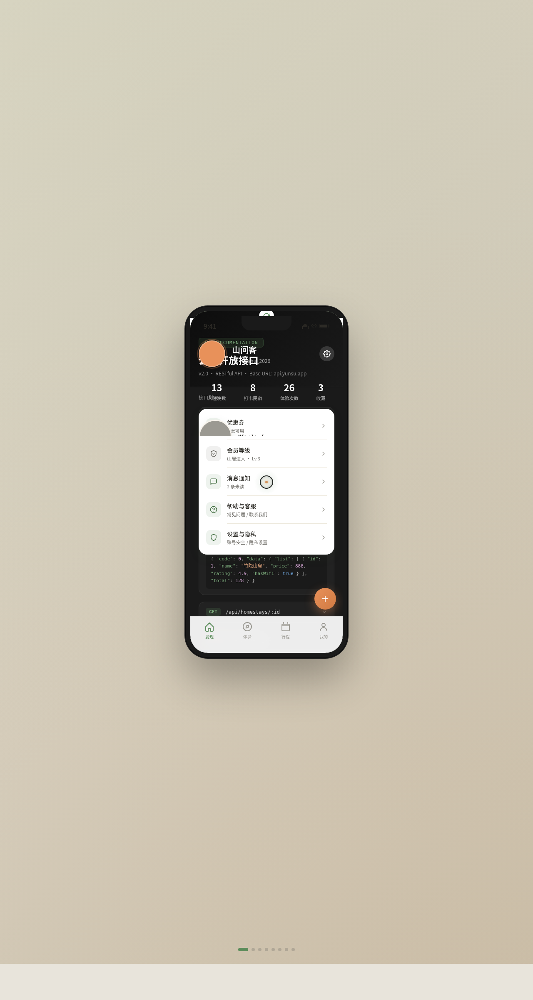

# 云宿·山居民宿

> 日期：2026-08-17 · 方向：V2 手机 UI · 形态：原生 App · 主题：山居民宿发现与预订 App

形态：原生 App

## 简介

一个聚焦山野民宿发现与预订的原生 App 原型，在统一手机外壳内可切换 8 个页面：发现首页、房型详情、山居体验、房东故事、我的行程、个人中心，以及设计规范页与接口文档页。内容围绕真实山居民宿组织。

## 截图

## 动效亮点

- 自定义光标（弹簧跟随 + 悬停放大 + 点击涟漪 + 多层发光）
- 首页竹叶飘落粒子 + 入场序列错峰上滑
- 详情页 Hero 视差滚动
- 行程页环形进度条动画
- 心形脉冲点赞、头像脉冲光环、FAB 悬停旋转
- 共 14+ 个组件级动效

## 原生端侧交互

底部 TabBar、底部半屏抽屉、悬浮 FAB、下拉刷新、模态弹窗、返回栈导航。

## 妙搭在线预览

https://dcniaqwtmoca.feishu.cn/page/I0PSm7PZxdbIe0aeHLhcpRI7nHR

## 文件说明

| 文件 | 说明 |
|------|------|
| index.html | 完整可运行源码（内联 CSS + JSX 内联） |
| preview.png | 页面截图 |
| 设计规范.md | 色彩/字体/组件/动效/页面结构规范 |

## 技术栈

单文件 HTML，React 18 + Babel standalone（feishucdn CDN），JSX 全部内联。

## 配色

竹青 #5B8C5A · 山岩灰 #6B6963 · 暖米白 #F7F3EC · 暮霞橙 #E8915A · 深林绿 #2D4A2B
