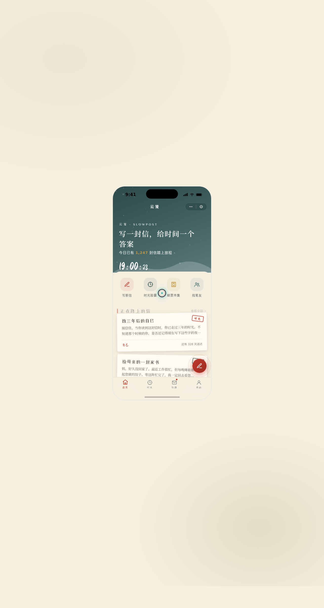

# 云笺 SlowPost · 书信慢递小程序

> 日期：2026-08-17 · 方向：V2 手机 UI · 形态：微信小程序 · 主题：书信慢递 / 时光胶囊 / 笔友

**形态：微信小程序**

（上一次 phone_mock 最新为原生 App「汉服衣橱」，本次交替为微信小程序）

## 简介

把一封手写信寄给未来的自己或远方的人。宣纸米白底 + 黛青 + 朱砂红 + 鎏金的古典书信配色，iOS 手机外壳内运行完整微信小程序 UI，共 8 个页面，覆盖写信、时光胶囊、信箱、笔友社区等场景，内容真实可信。

## 截图

## 动效亮点

- 自定义光标（白环 + 朱砂内点 + 多层发光 + 三态 + 涟漪）
- 首页入场序列动画（卡片错落旋转）
- 信件详情邮戳印章盖下动效
- 数字时钟实时走秒、环形进度缓动填充
- 下拉刷新弹性回弹、左滑列表操作

## 小程序端侧交互

页面栈 push/pop 右滑返回 · 底部 TabBar 选中微动效 · 半屏 ActionSheet · 下拉刷新弹性回弹 · 左滑列表操作 · 吸顶 Tab + 骨架屏。

## 在线预览

[云笺 · 书信慢递小程序](https://dcniaqwtmoca.feishu.cn/page/N2zJmaptQdzztYao47GcaIGRniZ)

## 文件说明

| 文件 | 说明 |
|------|------|
| index.html | 完整单页源码（HTML+CSS+JSX 内联） |
| components/ | ios-frame.jsx、tweaks-panel.jsx 组件 |
| preview.png | 1280×2400 预览截图 |
| thumbnail.png | 平台自动缩略图 |
| 设计规范.md | 色彩/字体/组件/动效/页面结构规范（含形态标记） |

## 技术栈

React 18 + Babel standalone（全部 JSX 内联于 index.html），CSS 内联。
