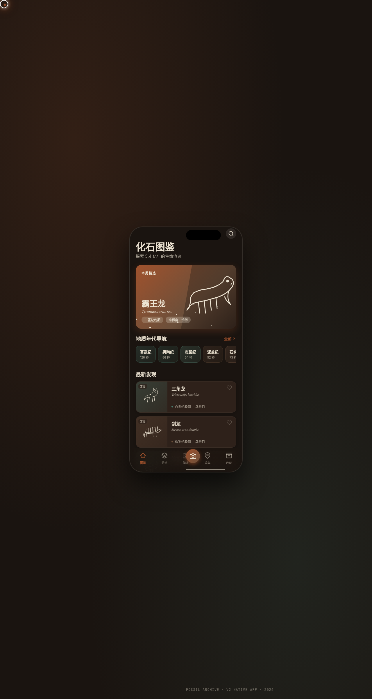

# 化石档案 Fossil Archive · 古生物化石收藏鉴定原生 App

形态：原生 App

> 日期：2026-08-17 · 方向：V2 手机 UI · 形态：原生 App（上一次为微信小程序，本次交替）
> 主题：古生物化石收藏与鉴定 · 配色：土褐 #6B4F3A + 骨白 #EDE4D3 + 铜绿 #4A7C6F + 深褐 #2E211A + 锈红 #A0522D（无蓝紫渐变）

## 简介

「化石档案 Fossil Archive」是一件完整多页面的古生物化石收藏与鉴定原生 App mock，在统一手机外壳内可切换 8 个页面。围绕化石图鉴（按地质年代浏览）、野外采集记录、AI 鉴定上传、个人收藏馆、鉴定社区组织真实可信内容（真实化石种名、地质年代、产地）。深褐地质感底 + 铜绿强调 + 锈红警示，营造考古标本室的沉稳质感。

## 截图

## 动效亮点

- 尘土颗粒飘浮（签名动效 1，首页背景）
- 旋转光环 + 扫描动画（签名动效 2，详情页 Hero）
- 自定义光标（白环 + 锈红内点 + 多层发光，悬停变形，点击涟漪）
- 下拉刷新弹性 / 长按快捷菜单 / FAB 悬浮 / 骨架 shimmer 等 12+ 组件级特效

## 文件说明

| 文件 | 说明 |
|------|------|
| index.html | 完整可运行源码（React + 内联 Babel JSX，含设计规范页/接口文档页） |
| ios-frame.jsx | 手机外壳框架组件 |
| 设计规范.md | 色彩系统、字体、组件、动效、页面结构（含形态标记） |
| preview.png | App 截图 |

## 妙搭在线预览

https://dcniaqwtmoca.feishu.cn/page/AJk1mGOqcdBLx0anCHzc4M55nEb

## 技术栈

React 18 + Babel Standalone（JSX 全部内联在 index.html 的 `<script type="text/babel">`，无外部 JSX 文件引用）。Canvas 粒子 + SVG 光环动画 + RAF 物理积分器。
