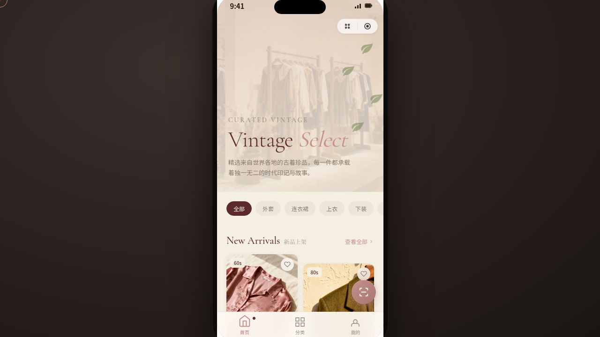

# 古着选物 Vintage Select · 微信小程序 UI

> 日期：2026-08-17 · 方向：V2 手机 UI · 形态：微信小程序 · 主题：古着选物店

形态：微信小程序

## 简介

一家精品古着选物店的微信小程序 UI，以灰玫瑰与鼠尾草橄榄为主色调，营造复古温暖的选物氛围。8 个页面：首页（Hero+瀑布流）、分类（吸顶筛选+双列卡片）、商品详情（轮播+吸底操作栏）、个人中心（酒红 Hero+宫格）、店铺故事（章节叙事+时间轴）、设计规范页、接口文档页、会员中心。微信小程序端侧交互含胶囊按钮导航栏、底部 TabBar、ActionSheet 半屏弹层、右滑返回、骨架屏加载等 7 种。

## 截图

## 动效亮点

- **SVG 描边入场**：首页品牌标识 SVG 路径描边动画
- **浮动叶片**：首页背景叶片漂浮签名动效
- **TabBar 图标弹跳**：选中态微动效
- **ActionSheet 抽屉**：半屏弹层滑入
- **骨架屏加载**：首页初始加载占位

## 文件说明

| 文件 | 说明 |
|------|------|
| `index.html` | 完整小程序 UI 源码（含 HTML/CSS/JS） |
| `preview.png` | 页面截图 |
| `设计规范.md` | 设计规范文档（色彩/字体/交互/页面结构） |

## 妙搭在线预览

https://dcniaqwtmoca.feishu.cn/page/NEzWmuMQtdstGMafPaIcKo0UnTc

## 技术栈

纯 vanilla HTML/CSS/JS 单文件，零外部 CDN 依赖。支持 prefers-reduced-motion、visibilitychange 自动暂停动画。
