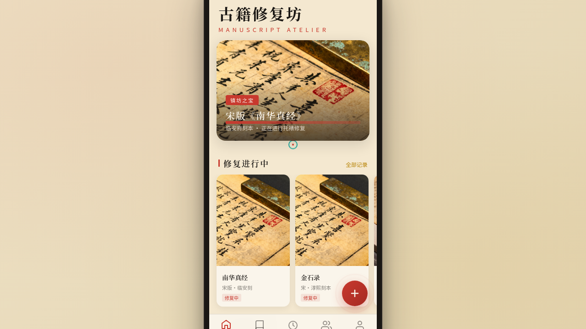

# 古籍修复坊 Manuscript Atelier · 原生 App

形态：原生 App

> 日期：2026-08-17 · 方向：V2 手机 UI · 形态：原生 App · 主题：古籍修复工坊

## 简介

一个古籍修复工坊的原生手机应用 mock，围绕宋版书、明刻本、敦煌写经等真实古籍修复场景组织内容。陈纸米黄 + 墨黑 + 朱砂红 + 古铜金的古籍修复暖调。统一手机外壳内可切换 9 个页面（含设计规范页与接口文档页），包含首页古籍信息流、善本浏览、修复记录时间线、修复详情视差、工坊预约日历、修复师社区、个人中心等。

## 截图

## 动效亮点

- 签名动效：朱砂红印章倾斜、朱墨刷痕下划线、金缮金线分隔
- 页面转场：push/pop 滑入滑出动画
- 视差滚动：详情页 Hero 大图随滚动位移
- 下拉刷新：弹簧回弹动画
- FAB 脉冲光环 + 卡片按压缩放
- shimmer 骨架屏 + 墨点扩散
- 数字计数 + Tab 下划线滑动

## 文件说明

| 文件 | 说明 |
|------|------|
| `index.html` | 完整源码（纯 HTML/CSS/JS 单文件） |
| `设计规范.md` | 色彩系统、字体、组件、动效、页面结构规范 |
| `preview.png` | 页面截图 |
| `thumbnail.png` | 缩略图 |

## 妙搭在线预览

https://dcniaqwtmoca.feishu.cn/page/SICNmPcl9dKVUOaxdw0cLn4DnVe

## 技术栈

- 纯 HTML/CSS/JS 单文件
- RAF 驱动动画 + visibilitychange 暂停
- prefers-reduced-motion 降级支持
