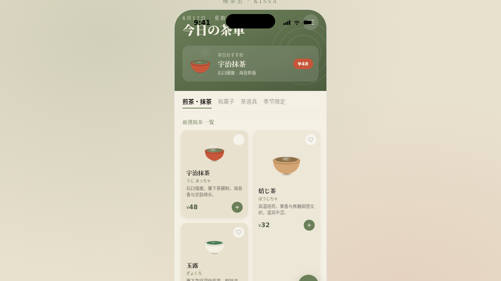

# 喫茶去 Kissa

- 日期：2026-08-17
- 方向：V2 手机 UI
- 形态：原生 App
- 主题：日式喫茶店 / 茶客厅原生 App

## 简介

一个日式喫茶店的原生 App 原型，8 个页面：今日茶單、茶品详情、座席予約、预约确认、茶仓、茶会、设计规范页、接口文档页。功能围绕茶单与限定菓子、坐席预约、茶仓藏品、茶会活动、会员展开，内容真实可信。

## 形态标记

形态：原生 App（上一轮为微信小程序，本轮交替为原生 App）

## 截图

## 动效亮点

签名动效：茶汤注入涟漪、蒸汽粒子上升、茶筅摆动、日历弹性展开、花瓣飘落。组件级特效 12+：Tab 图标弹跳、数字滚动、卡片级联渐入、心型跳动、FAB 脉冲光晕、shimmer 占位、底部抽屉上滑 + 毛玻璃等。原生交互 6 种：底部 TabBar、返回栈导航、底部半屏抽屉、FAB、下拉刷新、长按按压。

## 妙搭在线预览

https://dcniaqwtmoca.feishu.cn/page/HB8Imr2K7dsqOQaj7ZZchCYHnLf

## 文件说明

| 文件 | 说明 |
|------|------|
| index.html | 完整可运行源码（React + 内联 JSX/CSS） |
| components/ | 组件源码目录 |
| 设计规范.md | 色彩系统 / 字体 / 组件 / 动效 / 页面结构（含形态标记） |
| thumbnail.png | 页面截图 |

## 技术栈

React + Babel standalone（JSX/CSS 全部内联在 index.html）。配色：抹茶绿 / 宣纸米 / 漆器黑 / 柿红点缀。
