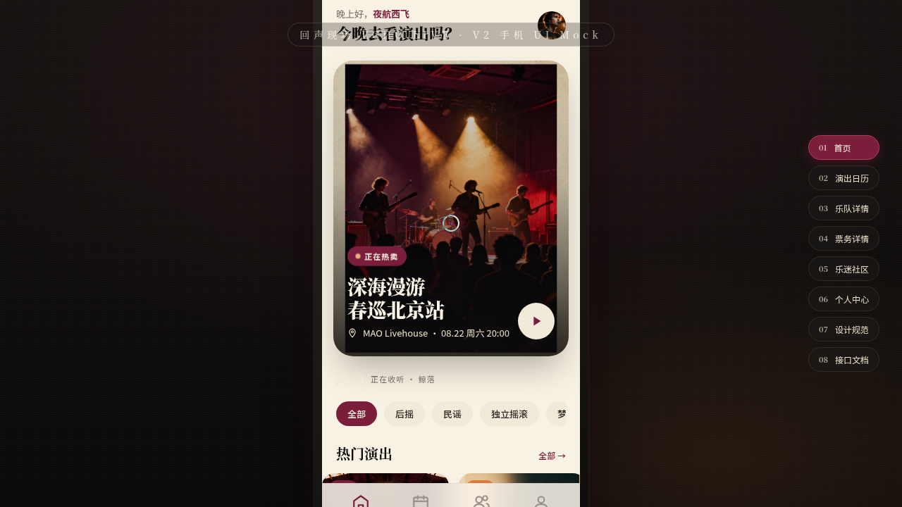

# 回声现场 Echo Live · 独立音乐现场 App

- 日期：2026-08-17
- 方向：V2 手机 UI
- 形态：原生 App
- 主题：独立音乐现场演出 App（Livehouse 日历 / 乐队主页 / 购票 / 社区）

## 简介

在统一 iOS 手机外壳内可切换 8 个页面的完整原生 App mock，围绕真实演出、乐队、场地、歌单组织内容。配色取勃艮第酒红 + 燕麦米 + 炭黑，纯色无蓝紫渐变。

## 截图

## 动效亮点

- 声波条（7 条不同周期）+ 首页入场序列
- 乐队详情页视差滚动 + 旋转唱片
- 个人页环形进度填充、票卡漂浮、下拉刷新弹性

## 在线预览

https://dcniaqwtmoca.feishu.cn/page/JfhRmn3mPdfBs6aPCTpcX26AnJe

## 文件说明

| 文件 | 说明 |
|---|---|
| index.html | 完整可运行源码（JSX 内联） |
| preview.png | 页面截图 |
| thumbnail.png | 平台缩略图 |
| 设计规范.md | 色彩 / 字体 / 组件 / 动效规范（含形态标记） |

## 技术栈

React + Babel standalone（JSX 全部内联在 `<script type="text/babel">`），无外部 JSX src 引用。
