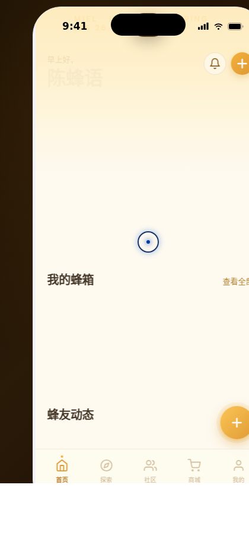

# Miel · 城市养蜂笔记 · Urban Apiary

> 日期：2026-08-17 · 方向：V2 手机 UI · 形态：原生 App · 主题：城市养蜂 / Urban Beekeeping

形态：原生 App

## 项目概述

Miel（法语"蜂蜜"）是一款面向城市养蜂人的原生 iOS App，帮助用户管理蜂箱、监测蜂群健康、记录收获、加入养蜂社区。

## 技术规格

- **形态**：原生 App（iOS 26 风格）
- **主题**：城市养蜂 / Urban Beekeeping
- **创作领域**：自然探索 · 生活方式
- **配色体系**：蜂蜜金（Honey Gold）+ 蜂蜡黄 + 深琥珀 + 奶油白 + 橄榄绿点缀
- **字体搭配**：Fraunces（展示衬线）+ Inter（正文无衬线）

## 页面清单（共 8 页）

| # | 页面 | 布局特点 |
|---|------|----------|
| 1 | 首页 Home | Hero 大卡片 + 横向滚动蜂箱 + 动态信息流 |
| 2 | 蜂箱详情 | 全屏 Hero + 视差滚动 + 环境监测仪表 + 时间线 |
| 3 | 社区 | Tab 切换 + 养蜂人 Spotlight + 瀑布流卡片 |
| 4 | 我的 | 头像脉冲 + 环形进度成就 + 宫格菜单 + 收获记录 |
| 5 | 探索 | 搜索栏 + 筛选 Chip + 地图（脉冲标记）+ 附近列表 |
| 6 | 商城 | 促销 Hero + 分类横滑 + 商品网格 + 购物车角标 |
| 7 | 设计规范 | 色板 + 字体样本 + 间距系统 + 图标库 + 组件预览 |
| 8 | 接口文档 | API 列表展开/收起 + 参数表 + 语法高亮响应示例 |

## 原生交互特性

1. **底部 TabBar** — 5 个主入口，选中态有顶部指示点微动效
2. **底部悬浮操作按钮 FAB** — 带脉冲光晕动效
3. **全屏详情页转场** — 蜂箱点击进入全屏详情，带返回导航
4. **长按快捷菜单** — 蜂箱卡片长按弹出上下文菜单
5. **模态底部弹层** — Bottom Sheet 样式
6. **Toast 通知** — 顶部下沉式提示
7. **毛玻璃 TabBar** — backdrop-filter 半透明效果

## 签名动效

1. **首页入场序列动画** — 元素级联渐入（hero / 标签 / 卡片 / 列表逐项错峰）
2. **详情页视差滚动** — Hero 图缩放 + 标题位移 + 透明度过渡
3. **小蜜蜂漂浮** — 首页 featured 卡片内蜜蜂循环浮动
4. **FAB 脉冲光晕** — 悬浮操作按钮呼吸发光
5. **数字计数动画** — easeOutCubic 缓动的数值滚动

## 组件级特效（12+）

- 自定义光标（白色粗环 + 金色内点 + 多层发光 + 涟漪点击）
- 页面切换过渡（滑入 + 透明度过渡）
- 数字计数动效
- 环形进度条动画
- 仪表条进度填充动画
- 地图标记脉冲扩散
- 头像脉冲环
- FAB 呼吸光晕
- 光泽扫过 Shimmer
- Tab 指示器弹性位移
- 卡片点击缩放反馈
- 小蜜蜂循环漂浮
- 时间线节点

## 截图

## 妙搭在线预览

https://dcniaqwtmoca.feishu.cn/page/PwlQm5mHIdd3j8a47VhcTaJln0b

## 文件说明

| 文件 | 说明 |
|------|------|
| index.html | 完整源码入口（HTML + 内联 CSS/JS + Babel JSX） |
| ios-frame.jsx | iOS 手机外壳组件 |
| tweaks-panel.jsx | 调试面板组件 |
| 设计规范.md | 色彩系统、字体、组件、动效规范 |
| preview.png | 页面截图 |
| README.md | 本说明文件 |

## 技术栈

React + Babel standalone（JSX 内联在 script 标签中），CSS 内联。Fraunces + Inter 字体，Canvas 2D 粒子动画，RAF 动画循环 + visibilitychange 暂停 + prefers-reduced-motion 降级。
