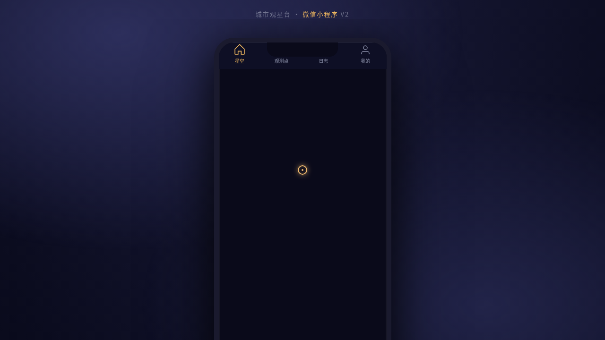

# 城市观星台 Urban Stargazing · 城市观星微信小程序

> 日期：2026-08-17 · 方向：V2 手机 UI · 形态：微信小程序 · 主题：城市观星

形态：微信小程序

## 简介

城市观星台是一款面向城市天文爱好者的微信小程序，帮助用户在光污染环境中找到可观测星空的角落。包含今夜星空图、光污染地图、观测点推荐、观测日志记录等功能，以午夜靛蓝为主色调，营造仰望星空的沉浸感。

## 截图

## 动效亮点

- **星空 Canvas**：120 颗呼吸闪烁星 + 流星划过
- **星座连线 SVG**：描边绘制 + 星点渐现
- **TabBar 选中微动效**：弹簧缩放 + 颜色过渡
- **下拉刷新弹性回弹**：弹性物理模型
- **左滑列表操作**：阻尼滑动 + 按钮渐显
- **时间线渐入**：staggered fade-in
- **行星浮动 + 旋转光环**：正弦浮动 + 等速旋转
- **骨架屏加载**：渐变扫光

## 小程序端侧交互

- 右上角胶囊按钮（···/⊙）
- 自定义导航栏（滚动吸顶变色）
- 底部 4 Tab TabBar（选中微动效）
- 页面栈 push/pop 切换
- 下拉刷新弹性回弹
- 左滑列表操作
- 吸顶 Tab 筛选
- 半屏 ActionSheet 弹层
- 骨架屏加载样式

## 文件说明

| 文件 | 说明 |
|------|------|
| index.html | 入口页（iframe 加载实际应用） |
| phone_mock/index.html | 完整可运行源码（React + Babel 内联） |
| phone_mock/android-frame.jsx | 手机外壳组件 |
| preview.png | 页面截图 |
| 设计规范.md | 色彩系统、字体、组件、动效规范 |
| README.md | 本文件 |

## 妙搭在线预览

https://dcniaqwtmoca.feishu.cn/page/ALyQmARLcdEDoHagrodcX1Uynhf

## 技术栈

React + Babel（JSX 内联在 `<script type="text/babel">`），CSS 内联在 `<style>` 标签。Canvas 2D 星空渲染，SVG 星座连线，visibilitychange 暂停 / prefers-reduced-motion 降级。
