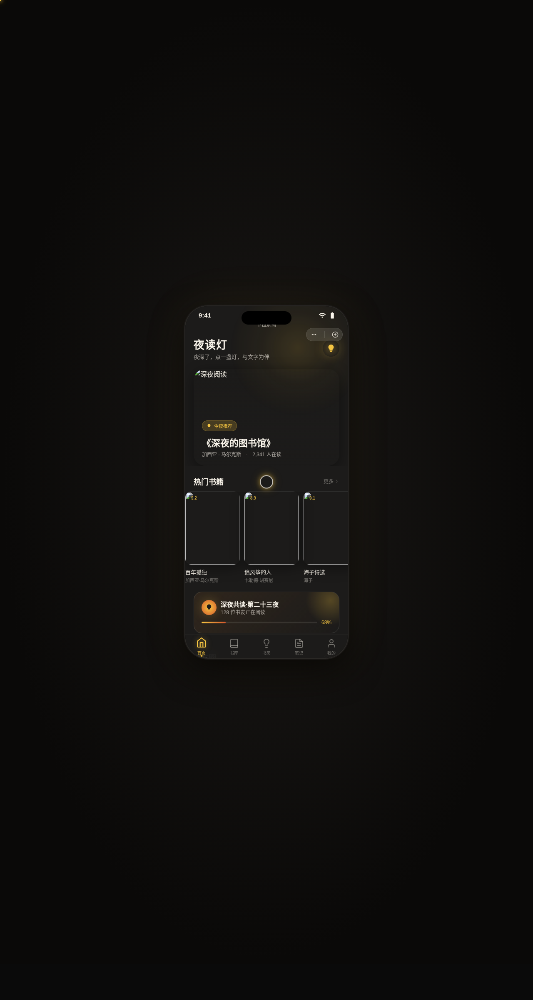

# 夜读灯 NightLamp · V2 手机 UI

> 日期：2026-08-17 · 方向：V2 手机 UI · 形态：微信小程序 · 主题：深夜阅读社区小程序

形态：微信小程序

## 简介

「夜读灯」是一个深夜阅读社区微信小程序。在深夜里点一盏灯，与文字为伴。8 个页面涵盖书籍推荐、书库分类、书籍详情、深夜书房（共读）、读书笔记、个人中心，附设计规范页与 API 文档页。配色取深夜灯光氛围——暖灯黄、夜墨蓝黑、余烬橙。

## 截图

## 动效亮点

- 首页灯光光晕呼吸（暖灯黄径向渐变脉动，贴合深夜点灯主题）
- 个人页环形阅读进度（渐变色圆环+数字递增动画）
- 详情页 Hero 视差滚动（下拉图片放大回弹、上滚视差位移）
- TabBar 选中态弹跳动效、下拉刷新弹性回弹、左滑列表操作

## 小程序端侧交互（6 种）

底部 TabBar（5 个，选中态弹跳）、页面栈 push/pop 右滑返回、ActionSheet 半屏弹层、下拉刷新弹性、左滑列表操作、吸顶 Tab 变色

## 页面清单

1. 首页：书籍推荐卡片流+灯光光晕
2. 书库/分类：吸顶筛选 Tab+瀑布流网格
3. 书籍详情：Hero 大图视差+底部吸底操作栏+书评
4. 深夜书房：灯光亮度调节+阅读计时+共读房间
5. 笔记：左滑操作+引用卡片
6. 个人中心：环形进度+宫格菜单+连续打卡
7. 设计规范：色板+字体+组件+动效
8. API 文档：暗色代码风格+端点分组

## 文件说明

| 文件 | 说明 |
|------|------|
| index.html | 完整源码（HTML/CSS/JS 单文件） |
| preview.png | 页面截图 |
| 设计规范.md | 设计规范文档（含形态标记） |

## 在线预览

[夜读灯 · 妙搭在线预览](https://dcniaqwtmoca.feishu.cn/page/IkWZmKh35dMwQdajuY5cXifrngh)

## 技术栈

纯 HTML/CSS/JS 单文件，无外部依赖
