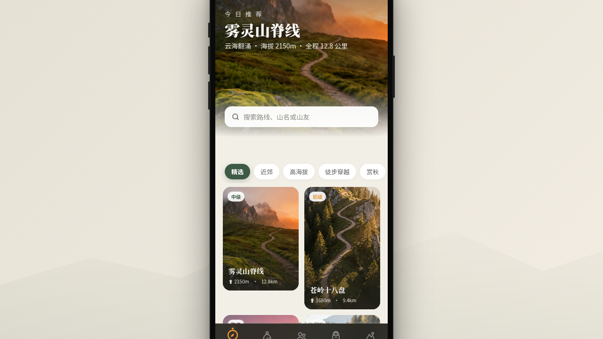

形态：原生 App

# 山径·徒步路线社区

> 日期：2026-08-17 · 方向：V2 手机 UI · 形态：原生 App · 主题：徒步与山野路线社区

## 简介

「山径」是徒步与山野路线社区的原生 App。首页以 Hero 大图 + 视差 + 瀑布流路线卡开场，支持下拉弹性刷新；路线详情页含视差 Hero、底部半屏抽屉、环形完成度与高程剖面；轨迹记录页深色模式 + FAB 悬浮球 + 脉冲环；社区动态卡片流支持长按快捷菜单与点赞弹跳；装备清单对角分割 Hero + 网格拼贴；我的成就深色模式 + 轮播勋章 + 等级环形进度。共 8 个可切换页面，含设计规范页与接口文档页。整体苔原绿 + 暖曦橙 + 雾米白的山野自然调。

## 动效亮点

- 自定义光标（白环 + 暖曦橙内点），mix-blend-mode 高对比，悬停 1.6×，点击涟漪
- 首页入场序列 + 下拉弹性回弹
- 详情页视差滚动 + 环形进度实时填充
- 点赞弹跳、Tab 缩放高亮、FAB 脉冲环、勾选圆弹出

## 配色

苔原绿 `#3D5A45` / 岩壁灰 `#5A5A58` / 暖曦橙 `#E8963C` / 雾米白 `#F2EFE7` / 深炭黑 `#26261F`。

## 原生端侧交互

底部 TabBar、返回栈导航、底部半屏抽屉模态、长按快捷菜单、下拉刷新、FAB 悬浮操作球、大标题导航栏、卡片式信息流（>4 种）。

## 文件说明

| 文件 | 说明 |
|------|------|
| `index.html` | 应用入口（内联 CSS + Babel JSX） |
| `components/` | 组件源码 |
| `thumbnail.png` | 页面截图 |
| `设计规范.md` | 色彩 / 字体 / 组件 / 动效规范 |

## 妙搭在线预览

https://dcniaqwtmoca.feishu.cn/page/X5VKmnFLVdRuJaaWtcocMPFUnqh

## 技术栈

React + Babel standalone（JSX 内联单文件），CSS 内联，零外部业务依赖。
