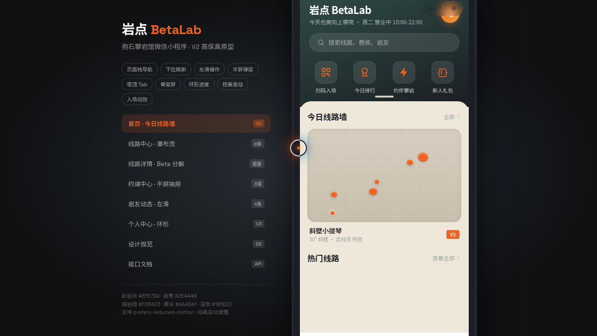

# 岩点 BetaLab · 攀岩馆微信小程序

形态：微信小程序

- **日期**：2026-08-17
- **方向**：V2 手机 UI
- **主题**：抱石攀岩馆微信小程序——今日线路墙（V0-V8 难度色标）、线路 Beta 动作分解、约课、岩友打卡、会员次卡与积分
- **配色**：砂岩米 `#EFE7DA` + 岩青 `#2E4A46` + 熔岩橙 `#F06423` + 雾灰 `#9AA5A1` + 深炭 `#1B1E22`（无蓝紫渐变）

## 简介

统一手机外壳内可切换 8 个页面的微信小程序 mock。端侧交互：胶囊按钮自定义导航栏、页面栈 push/pop 右滑返回、底部 TabBar、半屏 ActionSheet、下拉刷新弹性、左滑列表操作、吸顶筛选、骨架屏加载、吸底操作栏。内容围绕真实岩馆业务（线路名"斜壁小提琴""屋檐上的猫"、教练、岩友打卡）组织，无占位文字。

## 截图

## 动效亮点

13 个组件级特效：自定义光标、岩点入场序列、Tab 弹跳、FAB 脉冲、环形训练进度描边、数字计数、按钮光泽扫过、Hero 视差、骨架屏 shimmer、下拉刷新旋转、页面切换 slide-in、滚动渐入、会员卡进度填充。

## 在线预览
- 妙搭应用：https://dcniaqwtmoca.feishu.cn/page/BMjYmOWpddpDc3aTMsdc3oEQnKe

## 文件说明
| 文件 | 说明 |
|------|------|
| index.html | 完整可运行源码（JSX/CSS 全内联单文件） |
| components/ | 项目脚手架组件源文件 |
| 设计规范.md | 色彩系统、难度色标、字体、8 页面结构、端侧交互、动效 |
| preview.png / thumbnail.png | 小程序界面截图 |

## 技术栈
React 18 + Babel standalone（全内联）、CSS3 动画、自定义光标系统、prefers-reduced-motion 降级。
