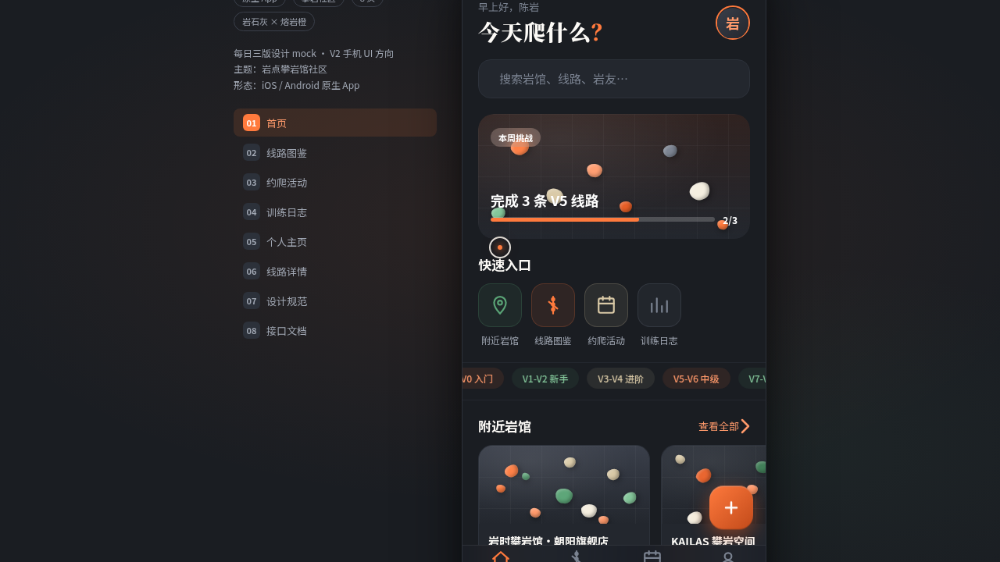

# 岩点 · 攀岩馆社区

> 日期：2026-08-17 · 方向：V2 手机 UI · 形态：原生 App · 主题：攀岩馆社区原生 App

## 简介

一个攀岩爱好者社区原生 App，在统一手机外壳内可切换 8 个页面：首页、线路图鉴、约爬活动、训练日志、个人主页、线路详情、设计规范页、接口文档页。岩石灰基底 + 熔岩橙主强调 + 苔绿辅助 + 米白表面，每页有独立色彩主角。

## 形态

形态：原生 App（iOS / Android 原生应用形态，底部 TabBar + FAB + 底部 Sheet + 大标题吸顶导航等原生交互语言）。

## 截图

## 动效亮点

- 首页 Hero 入场序列动画（错峰渐入）
- 线路详情页视差滚动 + 吸顶导航透明度渐变
- 个人页环形进度描边 + 头像脉冲光环
- 训练日志柱状图生长动画 + 对角分割数据卡

## 在线预览

https://dcniaqwtmoca.feishu.cn/page/H9UymQeqRdEtddatP3xcqDTsnrb

## 文件说明

| 文件 | 说明 |
|------|------|
| index.html | 完整可运行源码（React + JSX 内联于 text/babel） |
| components/ | iOS 设备外壳等辅助组件源码 |
| preview.png | 页面截图 |
| 设计规范.md | 色彩系统、字体、组件、动效、页面结构（含形态标记） |

## 技术栈

React + Babel standalone（JSX 全部内联），无构建步骤。
