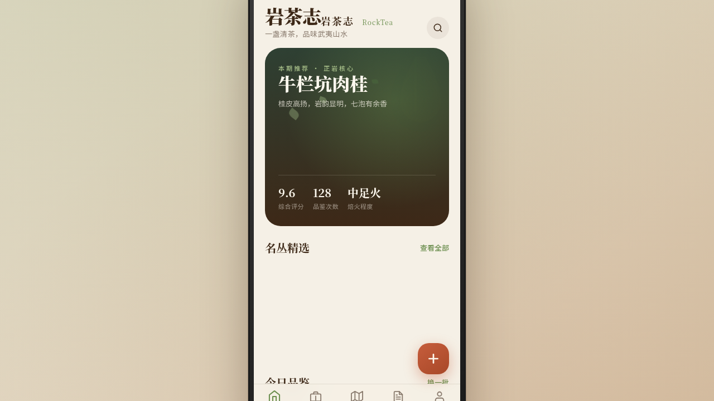

# 岩茶志 RockTea · 武夷岩茶品鉴记录 App

- **日期**：2026-08-17
- **方向**：V2 手机 UI
- 形态：原生 App

## 形态标记

形态：原生 App（上一轮最新为微信小程序「菌物图鉴」，本轮交替为原生 App）

## 简介

「岩茶志」是武夷岩茶品鉴记录原生 App，面向岩茶爱好者。可浏览茶品、记录品鉴笔记、查看山场信息、管理茶仓。套在统一 iOS 外壳内，8 个页面布局各异。内容围绕真实岩茶品种（大红袍、水仙、肉桂、铁罗汉、水金龟、半天腰、白鸡冠）与山场（牛栏坑、慧苑坑、大坑口、流香涧）组织，无 lorem ipsum。

## 设计说明

- **配色**：岩褐 `#3D2817` + 茶绿 `#6B8E4E` + 陶土 `#C65D3C` + 奶白 `#F5F0E6`，温暖醇厚茶山大地色系，无蓝紫渐变。
- **字体**：Noto Serif SC（标题）/ Noto Sans SC（正文）。
- **布局**：8 页布局各异——Hero 卡片流 / 瀑布流宫格 / 视差详情 + 风味轮 / SVG 山场地图 + 浮动面板 / 时间轴堆叠 / 深色环形进度个人页 / 规范页 / 接口页，至少 5 页独特非重复结构。

## 动效亮点

12+ 组件级特效：自定义光标（白环+茶绿点+发光+涟漪）、热气粒子升腾、茶叶飘落、入场序列、风味轮描边、环形进度、数字计数、视差滚动、光泽扫过、卡片浮起、Tab 弹性、Toast、下拉刷新弹性。签名动效：首页入场序列 + 详情页视差 + 个人页环形进度。

## 截图

## 妙搭在线预览

https://dcniaqwtmoca.feishu.cn/page/UlwimmEVAdkAGvaBL5KcKpavnhe

## 文件说明

| 文件 | 说明 |
|------|------|
| index.html | 完整可运行源码（JSX 内联） |
| 设计规范.md | 色彩 / 字体 / 组件 / 动效 / 页面结构（含形态标记） |
| thumbnail.png | 页面截图 |
| README.md | 本说明 |

## 技术栈

单文件 index.html，JSX 内联于 `<script type="text/babel">`，CSS 内联于 `<style>`，无外部 src 引用。
