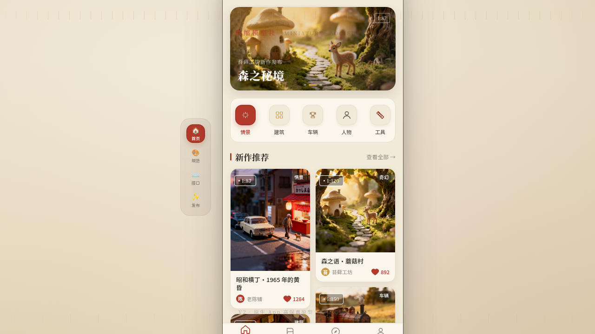

# 微缩模型社 Miniature Guild

> 日期：2026-08-17 · 方向：V2 手机 UI · **形态：原生 App** · 主题：微缩模型收藏与制作社区

## 简介

微缩模型爱好者的原生 App，集作品发现、制作教程、社区活动、个人主页于一体。铁盒红主色配奶油底与黄铜点缀，呈现手工模型的精致质感。8 个页面 6 种独特布局，含签名动效与设计规范/接口文档页。

## 截图

## 动效亮点

- 首页入场序列动画（4 步渐入）、详情页 Hero 视差滚动、个人页环形进度描边
- FAB 展开序列、点赞心跳缩放、Tab 图标弹性、下拉刷新旋转图标
- 自定义光标（白粗环 + 黄铜内点），悬停形态变化、点击涟漪

## 原生交互（6 种）

底部 TabBar、返回栈导航、下拉刷新弹性、FAB 悬浮操作球、底部半屏抽屉、模态分步表单

## 文件说明

| 文件 | 说明 |
|------|------|
| index.html | 完整可运行源码（React + Babel 内联 JSX，单文件） |
| 设计规范.md | 色彩系统、字体、页面布局、动效、原生交互 |
| preview.png / thumbnail.png | 应用截图 |

## 妙搭在线预览

https://dcniaqwtmoca.feishu.cn/page/TW9vmNpoid8iYCagEtMcyAwynke

## 技术栈

React + Babel standalone（JSX 内联），requestAnimationFrame 动效，支持 prefers-reduced-motion、visibilitychange 暂停。
