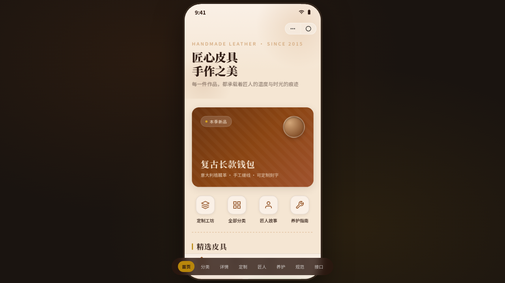

# 手工皮具 Leather Craft

> 日期：2026-08-17 · 方向：V2 手机 UI · 形态：微信小程序 · 主题：手工皮具工坊小程序

形态：微信小程序

「手工皮具 Leather Craft」是一个围绕手工皮具制作的微信小程序形态手机端 mock。包含皮具作品展示、定制工坊、匠人故事、养护指南等内容，在统一手机外壳内提供 8 个可切换页面。涵盖小程序端侧交互语言：胶囊按钮、页面栈 push/pop、底部 TabBar、半屏 ActionSheet、下拉刷新弹性、左滑列表操作、吸顶 Tab、底部安全区主按钮、骨架屏加载。

## 截图

## 动效亮点

- 首页入场序列动画（标题→卡片→列表逐级弹性滑入）
- 商品详情页视差滚动（产品图随滚动缩放位移）
- TabBar 选中态弹跳动效
- 下拉刷新弹性回弹
- 半屏弹层滑入 + 遮罩渐入
- 骨架屏 shimmer 闪烁

## 在线预览

[手工皮具 Leather Craft](https://dcniaqwtmoca.feishu.cn/page/SDxumHrPldpZMBaL8q1cJFddnBg)

## 文件说明

| 文件 | 说明 |
|------|------|
| index.html | 完整可运行的源代码（纯 HTML/CSS/JS 单文件） |
| preview.png | 页面截图 |
| thumbnail.png | 缩略图 |
| 设计规范.md | 设计规范文档 |

## 技术栈

纯 HTML/CSS/JS 单文件实现，无 React/Babel/CDN 依赖。IntersectionObserver + requestAnimationFrame，支持 prefers-reduced-motion 降级。

## 形态交替说明

本轮交替判定：上一轮最新 phone_mock 为「绿社_florapost」（原生 App），故本次做「微信小程序」。
