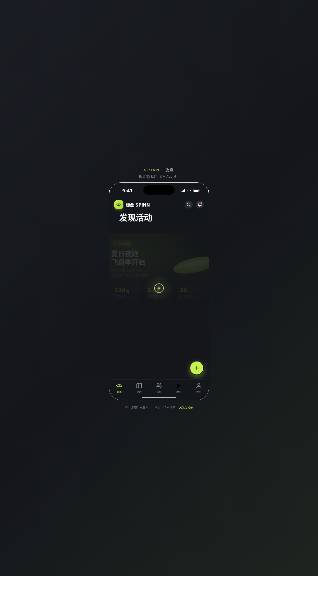

# 旋盘 SPINN · 飞盘社群 App

形态：原生 App

> 日期：2026-08-17 ｜ 方向：V2 手机 UI ｜ 主题：极限飞盘社群 ｜ 领域：运动户外

## 简介

一个完整多页面的飞盘社群原生 App mock，统一在 iOS 原生外壳内切换 8 个页面：活动信息流、活动详情、场地地图、队伍社区、技巧教学、个人中心、设计规范页、接口文档页。围绕飞盘活动约局、场地、队伍、技巧教学组织真实可信内容。荧光运动系配色（青柠荧光 #C6F24E + 炭黑 #14161A + 暖白 + 点缀橙），无蓝紫渐变。本轮交替判定：上一轮最新为微信小程序「节气食帖」，故本次做原生 App。

## 原生交互

大标题导航栏 / 返回栈导航、底部 TabBar（飞盘旋转选中态）、全屏详情页转场、底部半屏抽屉、FAB 悬浮操作按钮、模态弹窗、下拉刷新（飞盘旋转 + 阻尼回弹）——共 7 种原生 App 交互语言。

## 截图

## 动效亮点

自定义光标（白环 + 青柠内点 + 多层发光，开屏居中）、飞盘旋转签名动效、Hero 圆盘浮动、详情页视差滚动、下拉刷新弹性回弹、FAB 旋转展开、卡片错落入场、Tab 指示器滑动、地图标记弹跳、环形进度描边、底部抽屉滑入、模态弹入、报名按钮状态过渡——共 13 个组件级特效。支持 `prefers-reduced-motion` 降级；RAF / 定时器随 `visibilitychange` 暂停。

## 文件说明

| 文件 | 说明 |
|---|---|
| index.html | 完整源码（React + 内联 JSX + 内联 CSS） |
| components/ | 组件目录（平台 scaffold 产物） |
| preview.png | 页面截图（1280×2400） |
| thumbnail.png | 平台缩略图 |
| 设计规范.md | 色彩 / 字体 / 组件 / 动效 / 页面结构规范（含形态标记） |

## 妙搭在线预览

https://dcniaqwtmoca.feishu.cn/page/HHGhmGj21dZVyoaqxosc1ufnnYc

## 技术栈

React 18 + Babel standalone（内联 JSX）+ 纯 CSS，单文件 index.html。
