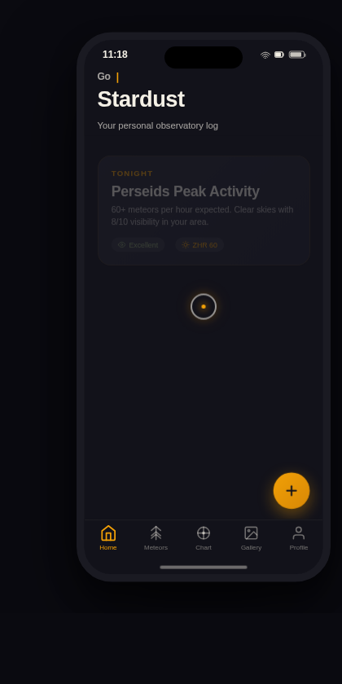

# 星砂观测台 Stardust Observatory · 星空观测日志原生 App

> 方向：V2 手机 UI · 日期：2026-08-17 · 形态：原生 App · 主题：流星雨与星空观测日志

## 简介

星砂观测台是一个流星雨与星空观测日志原生 App。用户用它记录观星笔记、追踪流星雨预报、浏览可拖拽星图与摄影佳作。采用 iOS/Android 原生交互语言：大标题导航栏、底部 TabBar、FAB、全屏详情转场、长按快捷菜单、下拉刷新。

## 截图

## 形态

原生 App（与上一次「微信小程序」交替）

## 配色

曜石黑 `#12121A` + 琥珀金 `#F2A007` + 苔绿 `#8FA672` + 象牙白 `#F4F0E6`，夜空暗色氛围，禁止蓝紫渐变。

## 动效亮点

- 星图页：SVG 可拖拽星图，点击星座触发连线绘制动画，惯性滚动
- 个人页：环形进度头像 + 观测统计数字计数
- 自定义光标：白环 + 琥珀金内点 + 多层发光
- 首页打字机问候语 + 卡片 3D 倾斜 + 下拉刷新弹性

## 在线预览

https://dcniaqwtmoca.feishu.cn/page/L8vmmM6L9dbxiTa3GfScjJd3n4f

## 文件说明

| 文件 | 说明 |
|------|------|
| index.html | 完整可运行源码（纯 vanilla 单文件） |
| preview.png | 页面截图 |
| 设计规范.md | 色彩/字体/组件/动效/页面结构规范（含形态标记） |

## 技术栈

纯 HTML/CSS/JavaScript，无 React/Babel/CDN 依赖。
