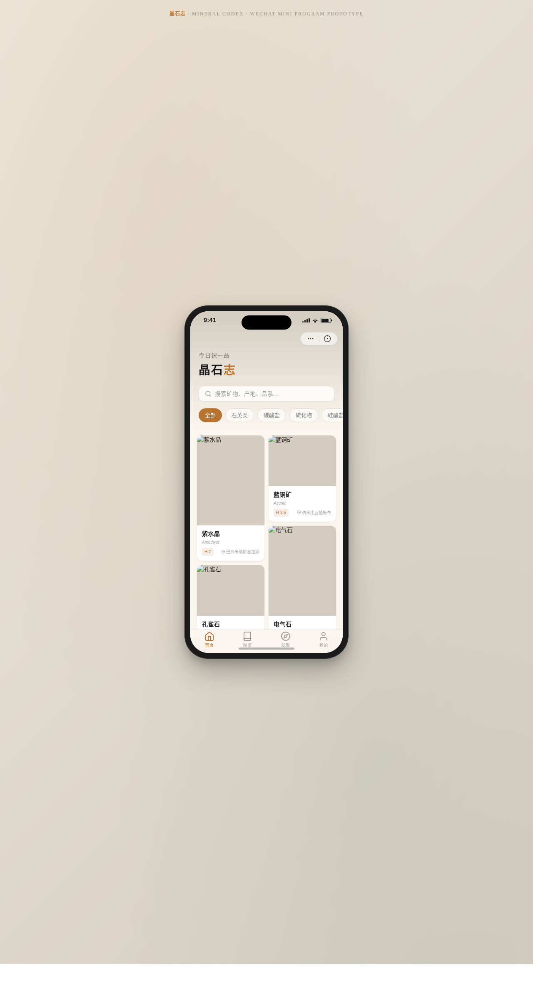

# 晶石志 Mineral Codex · V2 手机 UI

形态：微信小程序

> 日期：2026-08-17 · 方向：V2 手机 UI · 形态：微信小程序（上一次为原生 App，本次交替）· 主题：矿物标本收藏与鉴赏小程序

## 简介

晶石志是一个矿物标本收藏与鉴赏的微信小程序，采用暖石灰+铜琥珀+深翡翠的配色，模拟矿石的温润质感。包含 8 个页面：首页瀑布流、图鉴吸顶筛选、矿物详情视差、标本库环形统计、发现卡片流、个人中心、设计规范页、接口文档页。内容涵盖紫水晶、萤石、孔雀石、黄铁矿、方解石、蓝铜矿、电气石、石榴石等真实矿物品种。

## 截图

## 动效亮点

- 首页卡片错峰入场序列动画
- 详情页 Hero 大图视差滚动
- 标本库环形进度图 + 数字计数动画
- TabBar 选中弹性微动效
- 下拉刷新弹性回弹 + 左滑列表操作
- ActionSheet 半屏弹层 + 页面栈 push/pop 切换

## 端侧交互

底部 TabBar（4 个）、半屏弹层 ActionSheet、下拉刷新弹性回弹、左滑列表操作、吸顶 Tab、吸底操作栏、页面栈 push/pop、骨架屏加载（共 8 种，超出 4 种要求）

## 文件说明

| 文件 | 说明 |
|------|------|
| index.html | 完整可运行源码（纯 HTML/CSS/JS 单文件，零外部依赖） |
| 设计规范.md | 色彩系统、字体、组件规范、动效系统、页面结构（含形态标记） |
| preview.png | 页面截图（1280×2400） |

## 妙搭在线预览

https://dcniaqwtmoca.feishu.cn/page/Jckamvj3jdkbWjaJUFmcCTLunTd

## 技术栈

纯 HTML / CSS / JavaScript（单文件，无 React / 无 Babel / 无 CDN 依赖）
