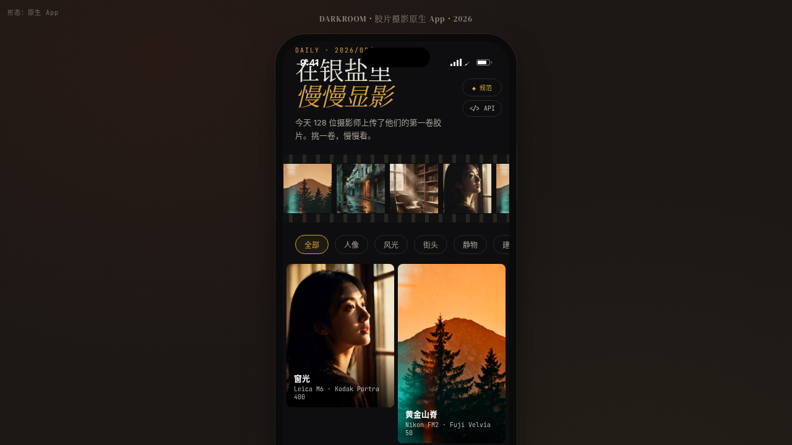

# 暗房 Darkroom · 胶片摄影原生 App

> 日期：2026-08-17 · 方向：V2 手机 UI · 形态：原生 App · 主题：胶片摄影原生 App（iOS 形态）

## 形态

形态：原生 App（V2 双形态交替：上一次为「微信小程序」，本次为「原生 App」）

## 简介

「暗房 Darkroom」是一个胶片摄影主题的原生 App 形态手机端 mock，围绕胶卷库、照片显影、暗房冲洗计时、摄影工作坊组织真实可信内容，在统一手机外壳内提供 8 个可切换页面。配色为墨黑 × 暗房红灯 × 琥珀黄 × 相纸米白，完全避开蓝紫渐变。

## 截图

## 动效亮点

- 照片显影入场（灰度→彩色 + 颗粒消散）
- 胶片卷轴横向滚动
- 环形拍摄进度动画
- 暗房红光计时器
- 13 项组件级特效 + 7 种原生交互（TabBar / 大标题导航 / 全屏转场 / 底部模态 / 下拉刷新 / FAB / 毛玻璃）

## 文件说明

| 文件 | 说明 |
|------|------|
| index.html | 应用入口（HTML+CSS+JSX） |
| ios-frame.jsx | iOS 手机外壳组件 |
| tweaks-panel.jsx | 调参面板组件 |
| 设计规范.md | 色彩、字体、组件、动效、页面结构 |
| preview.png | 页面截图 |

## 妙搭在线预览

https://dcniaqwtmoca.feishu.cn/page/CQVimU3qhdlpQ1aYR7ec1tU1nsi

## 技术栈

React（JSX）+ 内联 CSS + Babel standalone，妙搭构建系统打包。
