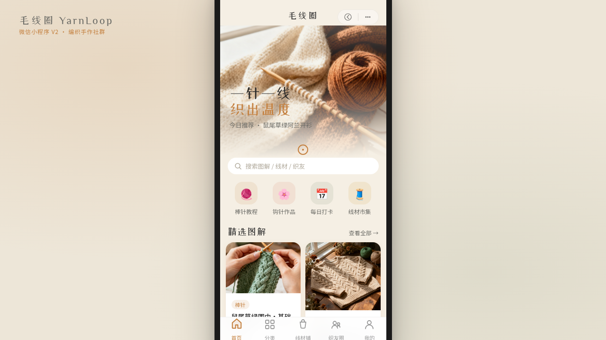

形态：微信小程序

# 毛线圈 · 编织手作社群小程序

> 日期：2026-08-17 · 方向：V2 手机 UI · 形态：微信小程序 · 主题：毛线编织手作社群

## 简介

「毛线圈」是毛线编织手好者的微信小程序社群。首页以图解教程瀑布流开场，支持下拉刷新与骨架屏加载；分类页按棒针 / 钩针 / 阿富汗针吸顶筛选；图解详情页含步骤图解与材料清单，底部吸底操作栏可收藏与开工；线材铺以色卡轮播呈现线团，半屏弹层选规格；织友圈可左滑收藏点赞；我的页展示编织时长环形进度。整体燕麦奶白与焦糖棕的柔和暖调贴合手作温度。

## 动效亮点

- 毛线球滚动 loading（下拉刷新）
- 毛线走线式进度条（详情页编织进度）
- 编织时长环形进度（毛线球沿圆环绕行）
- Tab 弹跳、卡片 fade-up 序列、点赞心跳、骨架屏闪光
- 自定义光标：焦糖棕描边 + 中心点，悬停变鼠尾草绿，开页居中

## 配色

燕麦奶白 `#F5EFE4` / 焦糖棕 `#C4803F` / 鼠尾草绿 `#8A9B7E` / 雾灰 `#6B6B66` / 桃粉 `#E8B4A0`。

## 文件说明

| 文件 | 说明 |
|------|------|
| `index.html` | 应用入口（内联 CSS + Babel JSX） |
| `components/ios-frame.jsx` | 手机外壳与导航栏组件 |
| `thumbnail.png` | 页面截图 |
| `设计规范.md` | 色彩 / 字体 / 组件 / 动效规范 |

## 在线预览

[毛线圈 · 妙搭预览](https://dcniaqwtmoca.feishu.cn/page/XYbTmjp8zdWZOVaiIHJcWQfBnDg)

## 技术栈

React（Babel standalone 内联 JSX）+ 自定义手机外壳，localStorage 模拟数据。
