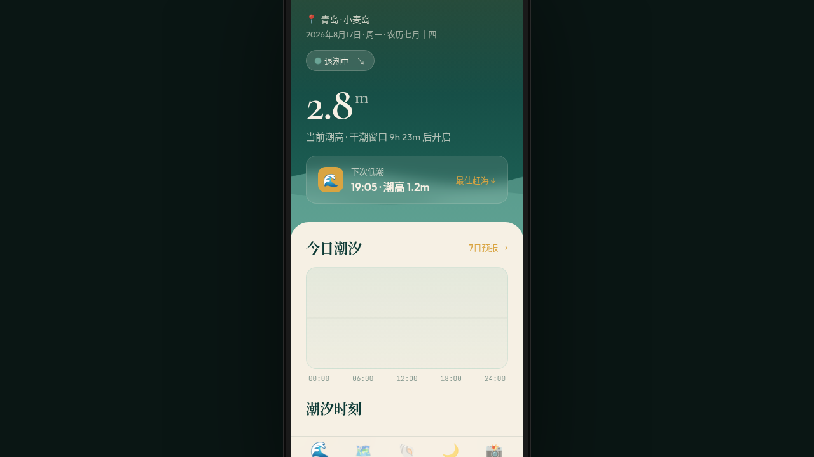

# 汐行者 Tidewalker · README

> 日期：2026-08-17｜方向：V2 手机 UI｜形态：原生 App｜主题：赶海潮汐指南

形态：原生 App

## 简介

「汐行者 Tidewalker」是一款赶海潮汐指南原生 App。今日潮汐首页用 Canvas 实时绘制潮汐曲线并叠加双频波浪，标注高潮/低潮/干潮时刻与潮高；赶海点探索页以轮播画廊呈现青岛小麦岛、厦门曾厝垵、大连金石滩、北海银滩等真实赶海点；海物图鉴页用马赛克拼贴展示花蛤、蛏子、青蟹、海葵、寄居蟹等（带可捕季节与识别要点），长按弹出快捷菜单；渔汛月历按月相标注大潮红点/小潮青点；社区页瀑布流晒收获，支持下拉刷新。深海带青+沙金+珊瑚橘配色。

## 形态

原生 App（形态 A）。原生端侧交互：大标题导航栏、底部 TabBar、全屏详情页转场、模态底弹窗、长按快捷菜单、下拉刷新、FAB 悬浮按钮（≥4 种）。

## 配色

深海带青 `#0E3B36` · 沙金 `#D9A441` · 珊瑚橘 `#E86A4A` · 贝壳米白 `#F6F0E4` · 浅滩青绿 `#7FBFB0`（详见 设计规范.md）

## 动效亮点

- 潮汐曲线 Canvas 绘制 + 余波振荡（首页签名动效）
- 双层 SVG 波浪流动（不同频率）
- 自定义光标（悬停放大 + 点击涟漪 + 跟随环）
- 页面左右滑入转场、模态缩放背景模糊
- 下拉刷新弹性回弹、TabBar 下划线滑动
- 月历红点/青点脉冲、按钮弹簧
- 彩蛋：连点 3 次顶部灵动岛展开开发者菜单

## 文件说明

| 文件 | 说明 |
|---|---|
| index.html | 完整可运行源码（React + Babel，全内联） |
| 设计规范.md | 色彩/字体/页面结构/交互/动效/接口 |
| preview.png | 页面截图 |
| thumbnail.png | 平台生成缩略图 |

## 在线预览

https://dcniaqwtmoca.feishu.cn/page/C91Oma08vdX7Vqann5tcDua5nSh

## 技术栈

React 18 + Babel Standalone（JSX 全内联），Canvas + SVG 动效。
