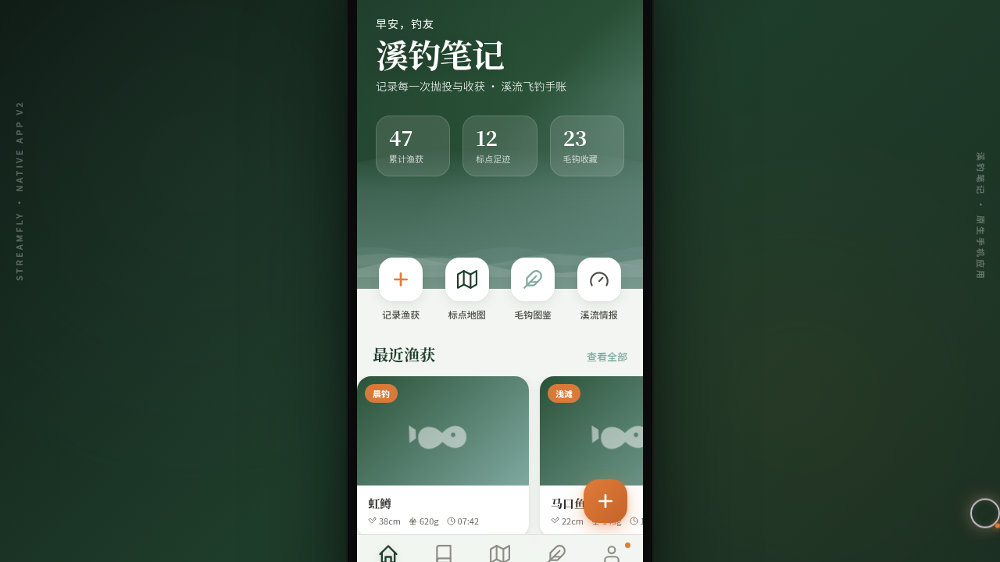

形态：原生 App

# 溪钓笔记 Streamfly · 手机 UI

> 日期：2026-08-17 · 方向：V2 手机 UI · 形态：原生 App · 主题：溪流飞钓手账应用

## 简介

「溪钓笔记」是溪流飞钓爱好者的原生手机应用。首页以溪流大图 + 三层波浪动效开场，含快捷入口、最近渔获横滑与 FAB；渔获记录采用卡片堆叠布局 + 下拉刷新 + 长按菜单；标点地图脉冲定位钉 + 底部半屏抽屉；毛钩图鉴瀑布流双列拼贴；溪流情报视差 Hero + 毛玻璃指标卡 + 五天钓况；钓友社群分段控件 + 信息流。共 8 页（含设计规范与接口文档），至少 5 页采用独特非重复布局。整体深杉绿 + 溪石青 + 鳟鱼橙的冷暖对比，贴合山林溪流意境。

## 动效亮点

- 三层不同周期波浪（首页 Hero）
- 鱼游动轨迹 + 毛钩漂浮
- 定位钉脉冲 + 环形进度条填充
- 入场序列动画（staggered）+ 视差滚动
- FAB 图标旋转 + Tab 图标弹跳
- 自定义光标：白环 + 橙点，悬停形变，点击涟漪，开页居中

## 妙搭在线预览

https://dcniaqwtmoca.feishu.cn/page/FY85mJsFydfAlTaf6iDcjvusnye

## 文件说明

| 文件 | 说明 |
|---|---|
| index.html | 完整可运行源码（React 内联 JSX + 内联 CSS） |
| components/ | 组件源码目录 |
| thumbnail.png | 页面截图 |
| 设计规范.md | 色彩 / 字体 / 组件 / 动效规范 |

## 技术栈

React + Babel 内联 JSX，CSS 内联，无外部 src 引用。
