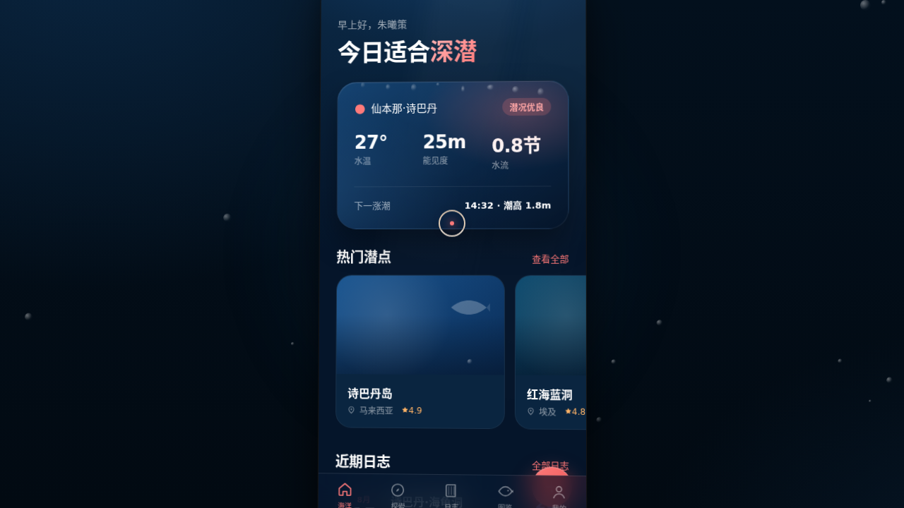

# 潜蓝日志 DiveLog

- **日期**：2026-08-17
- **方向**：V2 手机 UI
- **形态：原生 App**
- **主题**：水肺潜水员的原生手机 App——记录每一次下潜，发现全球潜点

深海午夜蓝 + 珊瑚粉 + 沙白的水下世界。记录下潜深度/时长/气瓶/水温，探索诗巴丹、红海蓝洞、图巴塔哈等真实潜点，翻阅鲸鲨、蝠鲼、海狼风暴的海洋生物图鉴，管理 PADI 证照等级。统一手机外壳内 8 页可切换，含设计规范页与接口文档页。

## 动效亮点

- 首页气泡上升粒子 + 入场序列动画 + 下拉刷新浮标弹性回弹
- 日志详情页深度曲线随滚动绘出 + Hero 视差滚动
- 我的页面环形进度绘制 + PADI 证照卡 3D 翻转
- 长按日志弹出快捷菜单（分享/编辑/删除）；模态底部抽屉；FAB 悬浮按钮
- 自定义光标：白环 + 珊瑚粉内点 + 发光，开页居中，悬停放大变色、点击涟漪

## 页面清单

今日海洋（首页）/ 潜点探索 / 潜水日志 / 日志详情 / 海洋图鉴 / 我的 / 设计规范 / 接口文档（`/api/mobile/v2/*`）——≥5 页独特非重复布局。

## 文件说明

| 文件 | 说明 |
|---|---|
| `index.html` | 应用入口（React 18 + Babel 内联 JSX，CSS 内联，统一手机外壳） |
| `components/` | 组件源码目录 |
| `设计规范.md` | 色彩系统 / 字体 / 组件 / 动效 / 页面结构（含形态标记） |
| `thumbnail.png` | 应用截图 |
| `README.md` | 本文件 |

## 在线预览

https://dcniaqwtmoca.feishu.cn/page/UCLCmTtncdZXVBanSDdctywOnHf

## 技术栈

React 18 + Babel standalone（JSX 全内联）+ SVG 深度曲线 + Canvas 气泡粒子，mousemove 直操作 DOM transform，visibilitychange 暂停、prefers-reduced-motion 适配。
