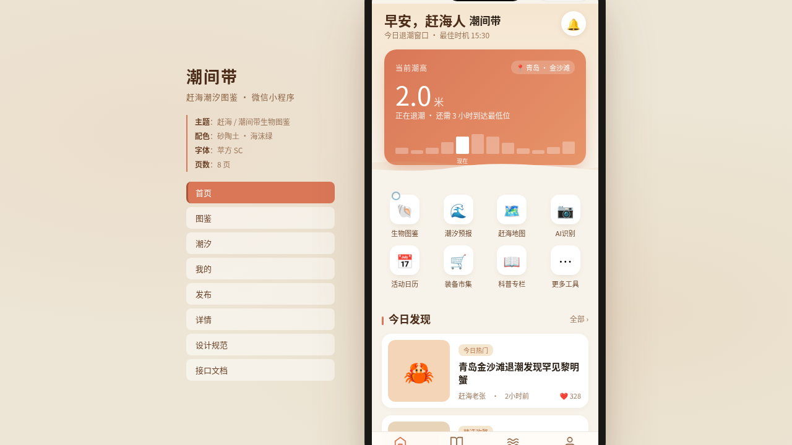

形态：微信小程序

# 潮间带 Tidal Flat Guide · 赶海潮汐图鉴小程序

> 日期：2026-08-17 · 方向：V2 手机 UI · 形态：微信小程序 · 主题：潮间带生物图鉴 / 赶海潮汐 / 潮池生态

## 简介

一个面向赶海爱好者的潮间带生物图鉴微信小程序。涵盖潮汐查询、物种图鉴、发现发布与个人成就，围绕真实潮池生态组织内容。在统一手机外壳内可切换 8 个页面。

## 设计说明

- 配色：砂陶土 + 海沫绿 + 砂米色体系（禁蓝紫渐变）
- 字体：PingFang SC（正文）/ SF Mono（潮汐数值）
- 小程序端侧交互：自定义导航栏胶囊按钮、底部 TabBar、页面栈 push/pop、ActionSheet 半屏弹层、下拉刷新弹性、悬浮操作球 FAB、表单吸底主按钮
- 至少 5 个页面独特非重复布局，2 个页面级签名动效

## 截图

## 动效亮点

自定义光标、海浪滚动、数字计数入场、卡片 3D 倾斜、光泽扫过、脉冲环、头像脉冲光环、FAB 浮动、Tab 弹跳、骨架屏、涟漪、环形进度动画。

## 妙搭在线预览

https://dcniaqwtmoca.feishu.cn/page/UvdkmsyerdNfUEa8M8RcKgFNnDh

## 文件说明

| 文件 | 说明 |
|------|------|
| index.html | 完整可运行源码（React + Babel 内联 JSX） |
| ios-frame.jsx | 手机外壳组件 |
| tweaks-panel.jsx | 调参面板组件 |
| 设计规范.md | 色彩、字体、布局、动效、页面结构 |
| preview.png | 页面截图 |
| thumbnail.png | 缩略图 |

## 技术栈

React + Babel standalone（JSX 内联于 index.html），CSS 内联。
