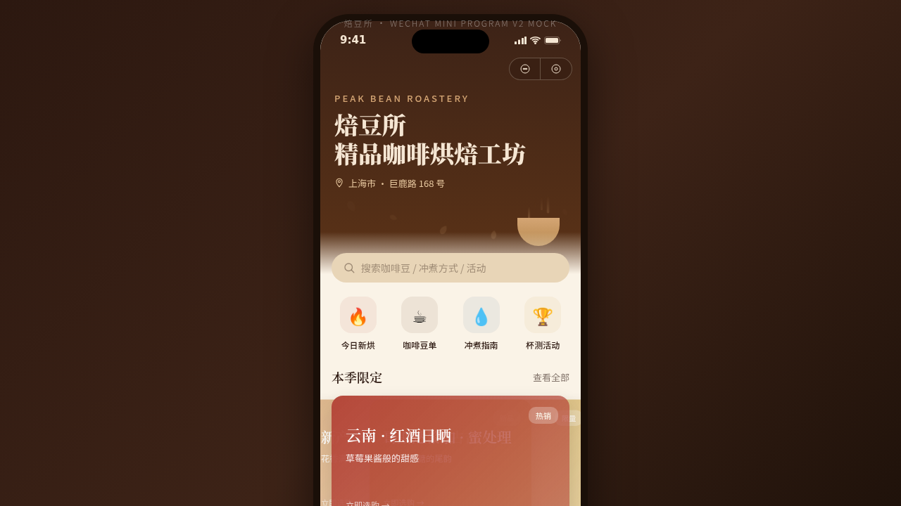

形态：微信小程序

# 焙豆所 · 精品咖啡烘焙工坊

> V2 手机 UI（微信小程序形态）· 2026-08-17 · 多页面手机端 mock

## 主题

一家精品咖啡烘焙工坊的微信小程序：豆单、烘焙批次、冲煮指南、杯测活动预约、会员体系，内容围绕产区 / 处理法 / 烘焙度 / 风味描述真实组织。

## 设计说明

深咖啡棕 + 焦糖琥珀 + 奶油白 + 砖红点缀的烘焙色系；8 个页面（5 个功能 Tab + 杯测活动 + 设计规范 + 接口文档）布局各异：Hero 视差、瀑布流、环形温度进度、对角分割、卡片拼贴 + FAB、玻璃拟态会员卡。

## 小程序交互语言（6 种）

页面栈 push/pop（右滑返回过渡）、底部 TabBar 选中微动效、ActionSheet 半屏弹层、下拉刷新弹性回弹、吸顶 Tab、底部吸底操作栏 + 安全区。

## 动效亮点

- 首页咖啡蒸汽升腾 + 咖啡豆悬浮上升（签名动效，主题语义）
- 烘焙页环形温度进度 + 实时温度跳动；会员页等级环形进度
- shimmer 骨架屏、tabDot 指示点、fabBounce 悬浮球等 12+ 组件级动效

## 在线预览

https://dcniaqwtmoca.feishu.cn/page/W0VUmVnladSgfTa944hcZYhDnMf

## 文件说明

| 文件 | 说明 |
|---|---|
| index.html | 应用入口（JSX 全部内联） |
| components/ | 组件源码 |
| 设计规范.md | 色彩 / 字体 / 页面结构 / 交互语言 / 动效系统 |
| thumbnail.png | 页面真实截图 |

## 技术栈

React（Babel standalone 内联 JSX）+ 原生 CSS 动效

## 交替标记

本次形态为「微信小程序」，下一次 V2 应为「原生 App」。
