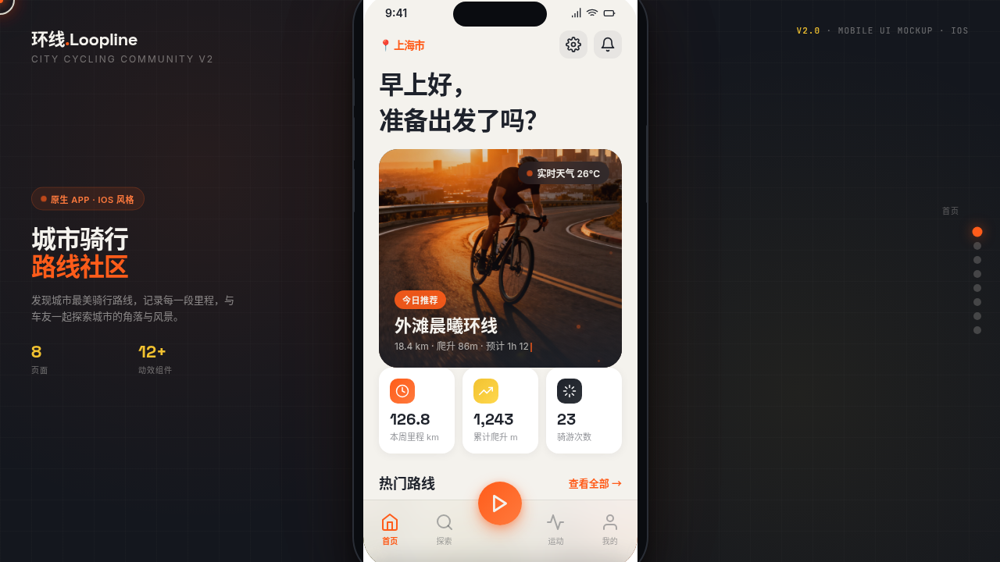

# 环线 Loopline · V2 手机 UI

> 日期：2026-08-17 ｜ 方向：V2 手机 UI ｜ 形态：原生 App ｜ 主题：城市骑行路线社区 App

## 简介

「环线 Loopline」是城市骑行路线社区原生 App（iOS 风格）。围绕骑行领域组织真实内容：城市骑行路线、爬升 / 距离 / 用时数据、路书、骑行活动、车友动态、运动数据、成就徽章、装备笔记。8 个页面全部真实可交互。

## 截图

## 动效亮点

- 自定义光标：白环 + 橙色内点 + 多层发光，开页即显，hover 形变，点击涟漪
- iOS 设备外壳 3D 鼠标倾斜跟随
- 弹簧物理数字计数 + 环形进度条
- 路线详情 SVG 轨迹路径绘制动画
- 卡片入场序列 / 柱状图展开 / 下拉刷新弹簧 / 模态底部抽屉

## 配色

信号橙 `#FF5C1A` + 沥青深灰 `#1E222B` + 晨雾白 `#F4F2ED` + 赛道黄 `#F2C230`（运动系，无蓝紫渐变）。

## 原生交互

底部 TabBar（含中心 FAB 凸起）、大标题导航栏 + 返回栈、模态底部抽屉、下拉刷新、瀑布流信息流、悬浮 FAB、卡片 3D 倾斜（≥4 种）。

## 文件说明

| 文件 | 说明 |
|---|---|
| index.html | 完整可运行源码（内联 CSS + Babel JSX，含 8 页面 + 规范页 + 接口页） |
| 设计规范.md | 色彩 / 字体 / 圆角 / 组件 / 动效 / 页面结构 |
| thumbnail.png | 预览截图 |

## 妙搭在线预览

https://dcniaqwtmoca.feishu.cn/page/Id6gmchbXdALCNaAGilcKdKPnCe

## 技术栈

HTML + 内联 CSS + React（Babel standalone 内联 JSX）+ Canvas / SVG / RAF 动效。
