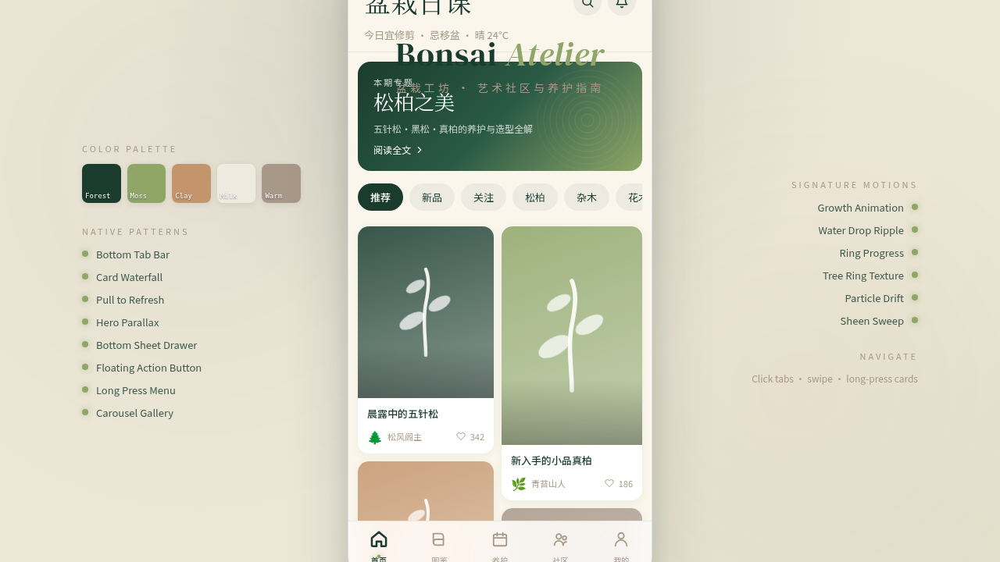

# 盆景 Bonsai Atelier

> 日期：2026-08-17 · 方向：V2 手机 UI · 形态：原生 App · 主题：盆景艺术社区与养护指南

形态：原生 App

## 简介

一个盆景艺术社区与养护指南原生 App。以深森林绿为主色调，苔藓黄绿与陶土棕点缀，营造禅意东方美学。包含盆景作品展示、品种图鉴、养护日历、社区分享、线下活动等功能。

## 截图

## 动效亮点

- 植物生长动画：SVG 枝干绘制 + 叶片弹出
- 水滴涟漪：养护日历浇水交互
- 年轮纹理装饰
- 环形进度条 + 数字滚动
- 头像脉冲环（社区故事/个人头像/FAB）
- 成就徽章发光呼吸
- 自定义光标：白环+彩色内点+点击涟漪
- 下拉刷新弹性回弹

## 在线预览

https://dcniaqwtmoca.feishu.cn/page/Zvf7m9ZF9dWAsjaLlNMcaNj0nSg

## 文件说明

| 文件 | 说明 |
|------|------|
| index.html | 完整 React 应用源码（JSX 内联） |
| components/ | 组件目录 |
| preview.png | 页面截图 |
| thumbnail.png | 缩略图 |
| 设计规范.md | 色彩/字体/组件/动效规范 |

## 技术栈

React（JSX 内联在 index.html），CSS 内联，Babel standalone 转译。
