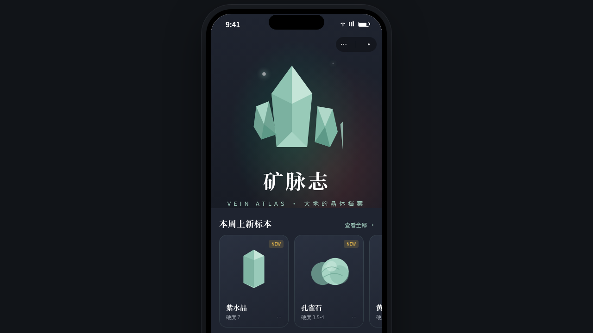

形态：微信小程序

# 矿脉志 Vein Atlas — 矿物标本小程序（V2 手机 UI）

- 日期：2026-08-17
- 方向：手机 UI · **微信小程序形态**
- 主题：矿物标本收藏与图鉴 —— 大地的晶体档案

## 简介

「矿脉志 Vein Atlas」是一个矿物标本收藏小程序的完整 8 页 mock，套在统一手机外壳（390×844）内运行：右上角小程序胶囊、随页面三态变化的自定义导航栏、4 Tab 底部栏。覆盖图鉴浏览、标本收藏管理、矿物文章与线下市集发现、个人中心，以及设计规范与接口文档两个元信息页。

## 小程序交互亮点（7 种端侧语言）

- 页面栈 push/pop：详情页右滑入、返回左滑出（带阴影）
- 半屏 ActionSheet 动作面板（可下滑关闭）
- 首页下拉刷新弹性回弹；图鉴页骨架屏加载
- 标本列表左滑露出「转让 / 删除」
- 发现页吸顶 Tab；详情页底部吸底操作栏

## 签名动效

首页晶体簇光点脉动 + 标题逐字浮现；详情页大晶体滚动视差 + 缩放；标本页环形进度 + 数字计数。

## 文件说明

| 文件 | 说明 |
|------|------|
| `index.html` | 完整源码（React + Babel CDN，JSX 全内联；在线预览走妙搭链接） |
| `preview.png` / `thumbnail.png` | 页面截图 |
| `设计规范.md` | 色彩 / 字体 / 组件 / 交互 / 页面结构规范 |

## 在线预览

https://dcniaqwtmoca.feishu.cn/page/MMRtmj1IEdduZjaTIbucGFDEnNf

## 技术栈

React 18 + Babel standalone（CDN），单文件内联 JSX/CSS；全部晶体为内联 SVG 手绘；`prefers-reduced-motion` 降级。
