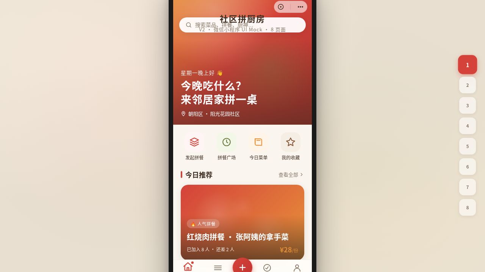

# 社区拼厨房 Community Kitchen

> 日期：2026-08-17 · 方向：V2 手机 UI · 形态：微信小程序 · 主题：社区共享厨房与拼餐交流小程序

形态：微信小程序

## 简介

「社区拼厨房」是一个微信小程序形态的手机 UI Mock，模拟社区共享厨房与拼餐交流场景。整体套在统一手机外壳内，含自定义导航栏+胶囊按钮，8 个页面可切换。配色采用番茄红+橄榄绿+暖橘的温暖色系，每页有独特的布局结构和丰富的视觉层次。

## 截图展示

## 动效亮点

- 首页入场序列动画（标题+卡片依次弹性浮现）
- 菜品详情滚动视差（Hero 图随滚动缩放+透明度过渡）
- TabBar 选中弹性缩放+小圆点指示器
- 下拉刷新弹簧物理弹性回弹
- 半屏弹层滑入/滑出
- 左滑列表操作
- 骨架屏闪烁加载
- 页面栈 push/pop 转场动画

## 妙搭在线预览

https://dcniaqwtmoca.feishu.cn/page/DJKpmuKeadsurlalvwWckOHcnbb

## 文件说明

| 文件 | 说明 |
|------|------|
| index.html | 完整源码（纯 HTML/CSS/JS 单文件） |
| ios-frame.jsx | iOS 手机外壳组件 |
| preview.png | 页面截图 |
| thumbnail.png | 缩略图 |
| 设计规范.md | 设计规范文档（含形态标记） |

## 技术栈

- 纯 HTML/CSS/JS 单文件实现（无 React/Babel/外部 CDN 依赖）
- 微信小程序端侧交互语言（页面栈/TabBar/半屏弹层/下拉刷新等）
- 支持 prefers-reduced-motion 降级
- visibilitychange 暂停 RAF 动画

## 页面清单

1. 首页「今日厨房」— Hero 渐变+4 宫格+推荐卡片流
2. 拼餐广场 — 吸顶 Tab+瀑布流+左滑操作
3. 菜品详情 — 全屏视差+吸底操作栏+半屏弹层
4. 发现/社区 — 对角分割+Masonry 图文流
5. 我的厨房 — 渐变头部+环形进度+宫格
6. 发布页 — 表单+吸底按钮
7. 设计规范页
8. 接口文档页（/api/mobile/v2/*）
