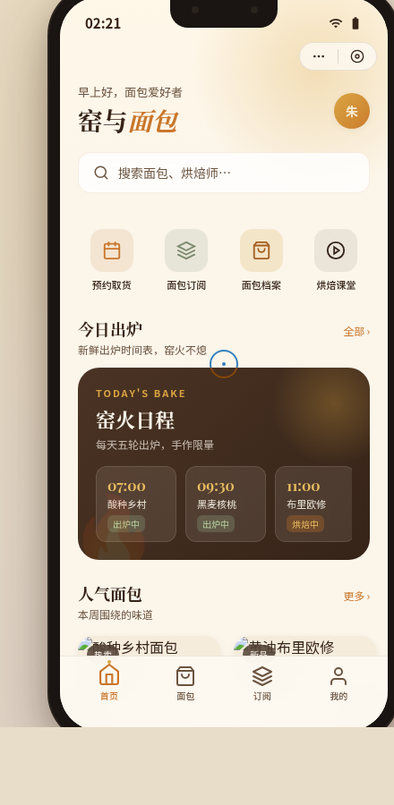

# 窑与面包 Kiln & Crumb · 手机应用 UI

- 日期：2026-08-17
- 方向：V2 手机 UI
- 形态：微信小程序
- 主题：窑与面包 Kiln & Crumb —— 社区柴火窑烤面包房小程序
- 配色：奶油白 #FBF5EA / 焦糖橙 #C9762B / 可可深棕 #362418 / 麦穗金 #D9A441 / 橄榄灰绿 #7C8A6E（禁蓝紫渐变）

## 简介

一家虚构但内容真实的社区窑烤面包房微信小程序。围绕窑烤面包组织内容：今日出炉时刻表（酸种乡村、黑麦核桃、布里欧修、佛卡夏…）、面包档案、预约取货、烘焙师故事、会员卡券、面包订阅。统一手机外壳内 8 页面可切换。

## 截图

## 形态标记

形态：微信小程序

## 小程序端侧交互

胶囊按钮 + 自定义导航栏、页面栈 push/pop + 右滑返回、底部 TabBar（选中微动效）、ActionSheet / 半屏抽屉、下拉刷新弹性回弹、吸顶筛选 Tab、吸底主按钮、骨架屏——共 7 种小程序特有交互。

## 动效亮点（符合窑烤面包主题语义）

- 窑火粒子上升（首页）
- 面包膨胀呼吸（会员头像）
- 面包卡 3D 倾斜
- 详情页滚动视差
- 会员进度条动画
- Tab 切换 bounce
共 ≥12 项组件级动效。

## 妙搭在线预览

https://dcniaqwtmoca.feishu.cn/page/SDGtmWAnpdRhGcaBCEqcPmcdnEb

## 文件说明

| 文件 | 说明 |
|---|---|
| index.html | React 应用入口（JSX/CSS 全内联） |
| preview.png | 手机端截图 |
| 设计规范.md | 色彩 / 字体 / 组件 / 布局 / 动效规范（含形态标记） |

## 技术栈

React + Babel standalone（全部内联 index.html，无外部 src 引用）。
