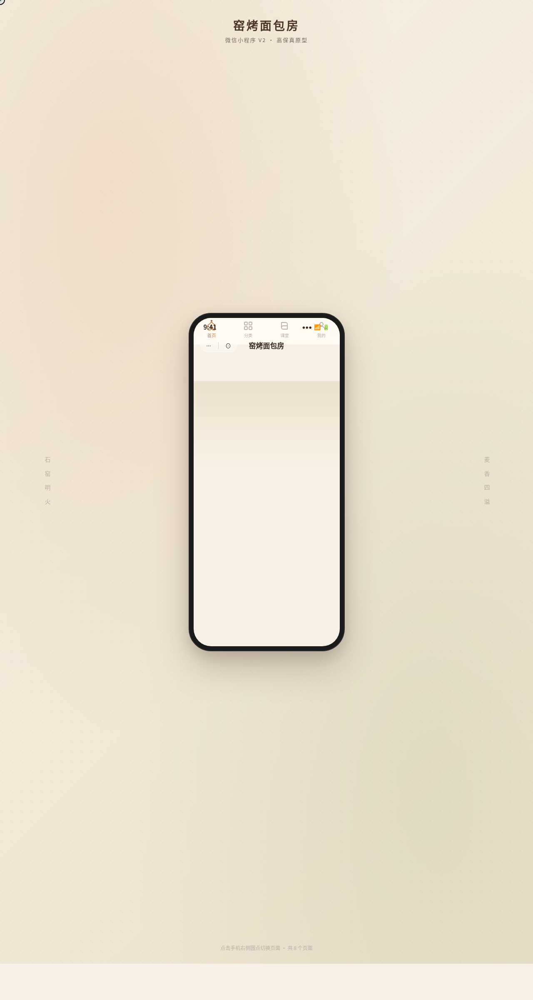

# 窑烤面包房 Kiln Bread · 微信小程序 UI

> 日期：2026-08-17 · 方向：V2 手机 UI · 形态：微信小程序 · 主题：社区窑烤面包小店

形态：微信小程序

## 简介

统一手机外壳内的 8 页窑烤面包房微信小程序：今日出炉时刻表、面包分类与预订、面包详情、窑烤课堂报名、会员面包票卡、个人中心，附设计规范页与接口文档页。暖米白 + 焦糖琥珀 + 深咖啡 + 开心果绿的烘焙暖调。小程序端侧交互含底部 TabBar、页面栈右滑返回、半屏 ActionSheet、下拉刷新弹性回弹、吸顶 Tab、吸底安全区主按钮、骨架屏、左滑列表、悬浮操作球。

## 截图

## 动效亮点

首页入场序列、详情页视差滚动、环形进度增长、FAB 浮动脉冲、头像光环旋转、窑火徽章呼吸灯、面包热度条填充、骨架屏 shimmer、涟漪点击 + 自定义光标，共 13 个组件级特效。

## 妙搭在线预览

https://dcniaqwtmoca.feishu.cn/page/VFTYmeZljdHrhca21WOcE8kln0b

## 文件说明

| 文件 | 说明 |
|------|------|
| index.html | 完整源码（内联 CSS + JSX/Babel，单文件） |
| preview.png | 页面截图 |
| 设计规范.md | 色彩/字体/组件/动效/页面结构规范 |
| thumbnail.png | 平台自动缩略图 |

## 技术栈

React 18 + Babel standalone（JSX 内联于 `<script type="text/babel">`），CSS 内联，SVG 环形进度，RAF 动效管理。
