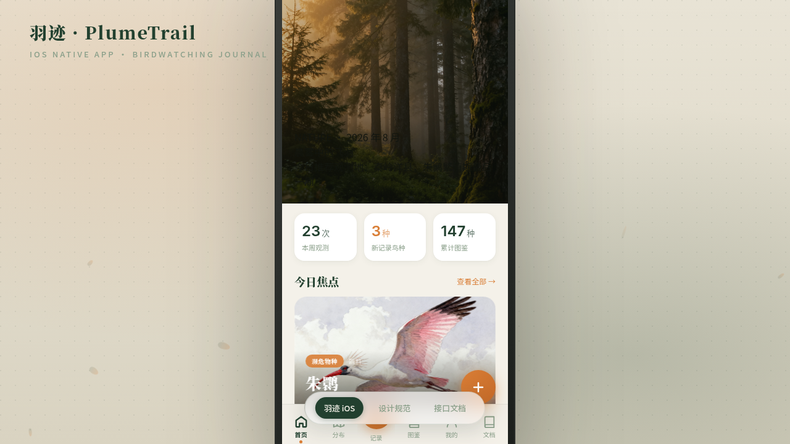

# 羽迹 PlumeTrail 观鸟 App

- **日期**：2026-08-17
- **方向**：V2 手机 UI
- **形态**：原生 App
- **主题**：观鸟记录与鸟种图鉴原生 App——围绕朱鹮、翠鸟、戴胜、红嘴蓝鹊、勺嘴鹬、白头鹎等真实鸟种组织观测记录、图鉴、分布与科普内容。
- **配色**：雾白 `#F4F1E9` + 深松绿 `#22402F` + 赭橙 `#D97E36` + 墨黑 `#12150F` + 灰绿辅 `#8CA08B`（无蓝紫渐变）

## 简介
统一手机外壳内可切换 8 个页面的完整原生 App mock。端侧交互：底部 TabBar、大标题导航栏滚动折叠、下拉刷新弹性、底部抽屉 Sheet、悬浮操作按钮 FAB、返回栈推入转场。内容围绕真实鸟种组织，无占位文字。

## 截图

## 动效亮点
14 个组件级特效：自定义光标（弹簧跟随+点击涟漪）、首页入场序列、Hero 视差滚动、下拉弹簧刷新、环形图鉴进度描边、声纹频谱柱、Tab 圆点弹跳、收藏心形弹跳、地图脉冲标记、羽毛粒子飘散、数字计数脉冲、卡片 3D 倾斜、波纹点击、骨架 shimmer。

## 在线预览
- 妙搭应用：https://dcniaqwtmoca.feishu.cn/page/Osabm9aVAdkUGCafD9Fc50jFnYe

## 文件说明
| 文件 | 说明 |
|------|------|
| index.html | 完整可运行源码（JSX/CSS 全内联单文件） |
| components/ | 项目脚手架组件源文件（ios-frame / tweaks-panel） |
| 设计规范.md | 色彩系统、字体、8 页面结构、端侧交互、动效 |
| preview.png / thumbnail.png | App 界面截图 |

## 技术栈
React 18 + Babel standalone（全内联）、CSS3 动画、自定义光标系统、prefers-reduced-motion 降级。
