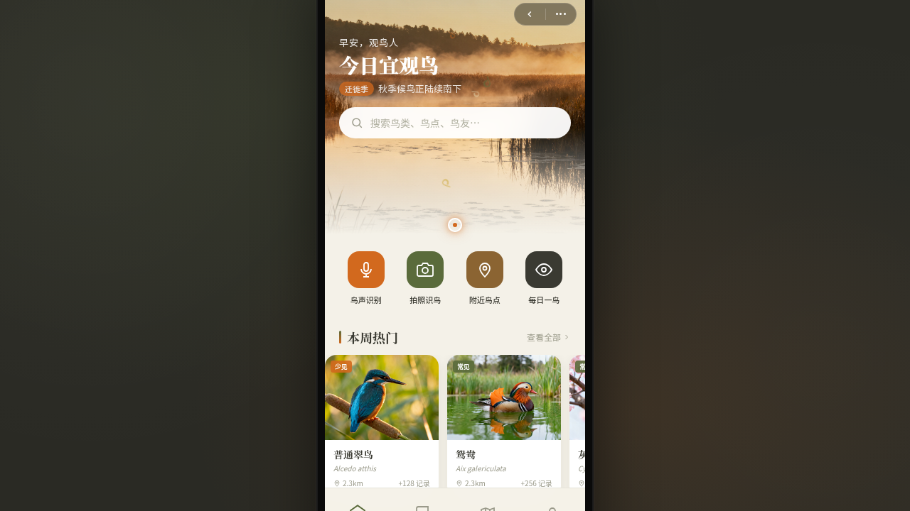

# 羽迹 Birdsight 观鸟小程序

形态：微信小程序

> 日期：2026-08-17 · 方向：V2 手机 UI · 形态：微信小程序 · 主题：观鸟记录小程序

## 简介

一个观鸟记录微信小程序，含鸟类图鉴、附近鸟点地图、鸟声识别、观鸟打卡、鸟友社区。在统一手机外壳内切换 8 个页面，采用小程序端侧交互语言（胶囊导航、页面栈 push/pop、TabBar、半屏弹层、下拉刷新、左滑操作、吸顶 Tab、骨架屏）。

## 配色

橄榄绿 `#5A6B3B` · 赤橙 `#D2691E` · 羽白 `#F4F1E8` · 暖灰 `#3A3A32` · 米黄 `#E8DDB5`

## 动效亮点

- 飞羽飘落入场序列（首页签名动效）
- 鸟鸣波形 + 迁徙轨迹 Canvas 绘制（详情页签名动效）
- 年度目标环形进度、地图标记脉冲、骨架屏 shimmer
- 自定义光标：白环 + 橙点 + 点击涟漪

## 文件说明

| 文件 | 说明 |
|------|------|
| index.html | 完整源码（React + Babel 内联单文件） |
| 设计规范.md | 色彩/字体/组件/动效/页面结构规范（含形态标记） |
| thumbnail.png | 页面截图 |

## 妙搭在线预览

https://dcniaqwtmoca.feishu.cn/page/CzURmivCvdqNBza4jCrcs1kMnFd

## 技术栈

React + Babel standalone（全部内联），Canvas 2D，CSS 动画，requestAnimationFrame。
